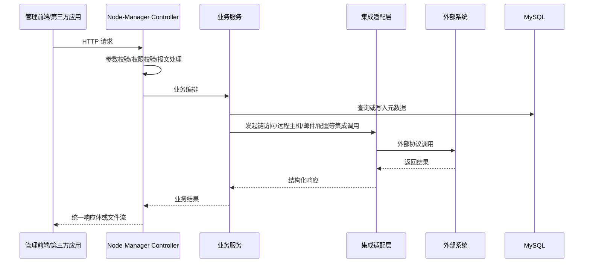
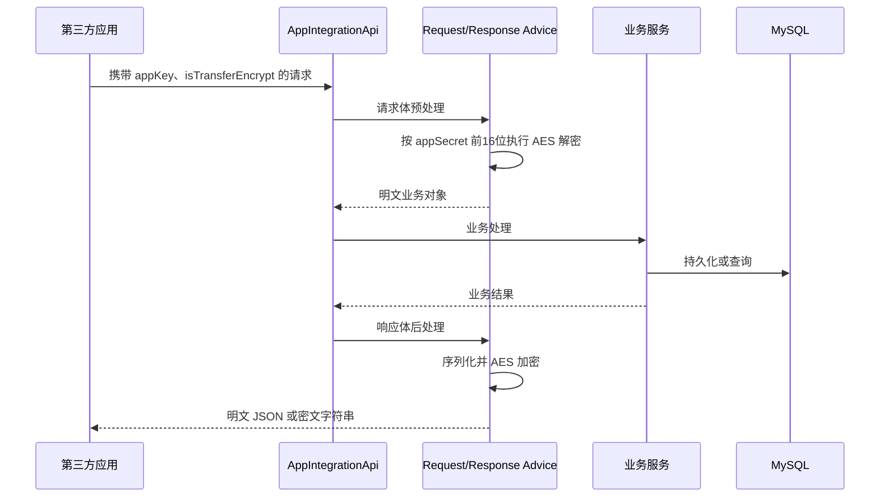

# WeBASE-Node-Manager 数据接口设计

## 1. 文档说明

### 1.1 文档目的

本文档用于定义 `WeBASE-Node-Manager` 在管理端、第三方应用接入端以及内部外部协同过程中涉及的数据接口设计，明确接口通信协议、调用标准、数据格式、安全约束、异常约定和关键交互流程，为后续接口开发、联调测试、系统集成和运维实施提供统一依据。

### 1.2 适用范围

本文档覆盖以下接口设计范围：

- 管理前端与节点管理服务之间的管理类 REST 接口
- 第三方业务系统与节点管理服务之间的开放集成接口
- 节点管理服务与 WeBASE-Front、WeBASE-Sign、Dubbo 服务、远程主机、邮件服务、配置中心之间的数据交换接口
- 文件上传、文件下载、证书分发、私钥导入导出等特殊数据交互场景

### 1.3 设计依据

- 项目源码目录：`src/main/java/com/webank/webase/node/mgr`
- 应用配置：`src/main/resources/application.yml`
- 配置属性：`src/main/java/com/webank/webase/node/mgr/config/properties/ConstantProperties.java`
- 统一返回与异常：`src/main/java/com/webank/webase/node/mgr/base/entity`、`src/main/java/com/webank/webase/node/mgr/base/exception`
- 已有设计文档：`docs/系统概要设计.md`、`docs/系统架构设计.md`、`docs/系统详细设计.md`
- 数据接口说明模板：`src/main/resources/数据接口设计-prompt.md`

## 2. 接口设计目标与原则

### 2.1 设计目标

`WeBASE-Node-Manager` 的数据接口设计目标如下：

- 对外提供统一、稳定、可扩展的节点管理服务接口
- 对内屏蔽区块链底层访问、远程主机控制和第三方服务差异
- 统一 JSON 结构、分页结构、错误码和鉴权约定
- 支持管理端接口与开放接口分域治理
- 支持文件流、密文报文、动态群组数据等多种数据交换模式

### 2.2 设计原则

- 统一入口原则：管理类接口统一由本服务 REST 入口承接
- 分域组织原则：接口按部署、群组、节点、合约、用户、监控、治理、告警、应用集成等业务域划分
- 适配隔离原则：链访问统一经由 WeBASE-Front，远程主机统一经由 Dubbo 与 Ansible/SSH 适配
- 数据一致原则：管理元数据以数据库为准，链上运行态与统计结果通过接口拉取和后台同步形成最终一致
- 安全可控原则：管理端接口执行权限校验，开放接口执行应用身份校验与可选报文加解密

## 3. 接口总体设计

### 3.1 接口分层

系统数据接口设计为四层：

| 层次 | 接口对象 | 主要协议 | 主要数据格式 |
| --- | --- | --- | --- |
| 管理接入层 | 管理前端、运维操作台 | HTTP/HTTPS | JSON、`multipart/form-data`、二进制文件流 |
| 开放接入层 | 第三方业务应用 | HTTP/HTTPS | JSON、密文字符串、`multipart/form-data` |
| 集成适配层 | WeBASE-Front、Dubbo 服务、SMTP、Nacos | HTTP、Dubbo、SMTP、配置订阅 | JSON、Java 对象、文本配置 |
| 运维执行层 | Ansible、SSH、Docker、Shell | Shell 命令、SSH、文件同步 | 命令参数、文本输出、配置文件、证书文件 |

### 3.2 接口分域

系统对外和对内的数据接口按如下域划分：

| 接口域 | 入口前缀 | 说明 |
| --- | --- | --- |
| 部署与主机运维 | `/host`、`/deploy`、`/chain` | 主机检查、链初始化、配置生成、节点启停、链启停、升级与进度查询 |
| 前置、群组、节点 | `/front`、`/group`、`/node` | 前置刷新、群组同步、群组操作、节点列表与详情 |
| 合约与链上资源 | `/contract`、`/abi`、`/method`、`/warehouse`、`/scaffold` | 合约源码、ABI、方法解析、部署调用、仓库与脚手架 |
| 用户、证书与外部识别 | `/user`、`/cert`、`/external` | 链用户、公私钥、证书、外部账户与外部合约识别 |
| 数据浏览与监控 | `/block`、`/transaction`、`/event`、`/stat`、`/performance`、`/monitor` | 区块、交易、事件、统计、性能、交易审计 |
| 预编译与治理 | `/precompiled`、`/permission`、`/governance`、`/sys`、`/vote` | CNS、共识、CRUD、权限、委员会、阈值、系统配置 |
| 告警与通知 | `/alert`、`/alert/mail`、`/mailServer`、`/log` | 告警规则、邮件测试、邮件配置、告警日志 |
| 应用接入与开放服务 | `/app`、`/api` | 第三方应用管理、应用注册、开放资源查询、应用导入 |

### 3.3 通信协议与编码标准

- 管理端与开放端接口统一采用 HTTP/HTTPS over TCP
- 请求与响应正文默认采用 `application/json;charset=UTF-8`
- 文件上传采用 `multipart/form-data`
- 文件下载采用 `application/octet-stream`
- 文本内容、JSON、密文串统一使用 UTF-8 编码
- 群组、节点、合约、用户等业务标识采用路径参数或查询参数传递

### 3.4 统一返回格式

#### 3.4.1 普通响应

普通响应采用统一结构：

```json
{
  "code": 0,
  "message": "success",
  "data": {},
  "attachment": null
}
```

字段定义如下：

| 字段 | 类型 | 说明 |
| --- | --- | --- |
| `code` | `int` | 业务返回码，`0` 表示成功 |
| `message` | `string` | 返回消息 |
| `data` | `object` | 业务数据，按接口语义承载 |
| `attachment` | `string` | 附加说明，主要用于异常补充 |

#### 3.4.2 分页响应

分页响应采用统一结构：

```json
{
  "code": 0,
  "message": "success",
  "data": [],
  "totalCount": 0
}
```

字段定义如下：

| 字段 | 类型 | 说明 |
| --- | --- | --- |
| `data` | `array` | 当前页数据 |
| `totalCount` | `int` | 满足条件的总记录数 |

### 3.5 异常与状态码约定

- 参数校验异常返回 HTTP `400`
- 业务异常返回 HTTP `400`
- 非预期运行异常返回 HTTP `500`
- 返回体仍保持统一 `BaseResponse` 结构
- 业务码采用 `ConstantCode` 中的统一编码体系，例如：
  - `0`：成功
  - `202010`：请求 WeBASE-Front 失败
  - `202018`：参数信息非法
  - `202080`：邮件发送失败
  - `202052` / `202053`：令牌无效或过期

### 3.6 统一交互流程



## 4. 管理端接口设计

### 4.1 设计定位

管理端接口面向平台管理员、开发者和运维人员，承担节点管理、链运维、合约管理、用户管理、监控告警和治理操作等职责。该类接口以权限校验、显式操作语义和统一返回结构为核心设计要求。

### 4.2 鉴权与权限约束

- 管理端接口应纳入统一登录态体系
- 接口权限以 `@SaCheckPermission` 为粒度设计
- 当前登录用户信息通过统一登录上下文获取
- 开发者角色在用户、合约、外部对象等场景下按账户范围约束数据可见性
- 涉及签名服务的链路，应向下游透传当前登录 `tokenKey/tokenValue`

### 4.3 管理端接口清单

| 业务域 | 代表接口 | 主要方法 | 主要数据对象 |
| --- | --- | --- | --- |
| 部署与主机 | `/host/ping`、`/host/check`、`/deploy/init`、`/deploy/config`、`/deploy/node/start`、`/deploy/progress` | `GET`、`POST`、`DELETE` | 主机、链、机构、节点部署清单、镜像标签、进度结果 |
| 前置与群组 | `/front/refresh`、`/front/new`、`/group/all`、`/group/generate`、`/group/operate/{nodeId}` | `GET`、`POST`、`PUT`、`DELETE` | 前置服务、群组、前置群组映射 |
| 节点管理 | `/node/nodeList/{groupId}/{pageNumber}/{pageSize}`、`/node/nodeInfo/{groupId}/{nodeId}`、`/node/description` | `GET`、`PUT` | 节点基础信息、运行状态、地理位置信息 |
| 合约管理 | `/contract/save`、`/contract/deploy`、`/contract/transaction`、`/contract/registerCns`、`/abi`、`/method/add` | `GET`、`POST`、`PUT`、`DELETE` | 合约源码、ABI、方法、部署入参、交易回执、CNS 记录 |
| 用户与证书 | `/user/userInfo`、`/user/bind`、`/user/importPem`、`/user/exportPem`、`/cert/sdk/{frontId}` | `GET`、`POST`、`PUT`、`DELETE` | 链用户、私钥、公钥、PEM/P12、证书内容 |
| 区块链数据浏览 | `/block/**`、`/transaction/**`、`/event/**`、`/stat`、`/performance/**` | `GET`、`POST` | 区块、交易、事件日志、统计指标、性能参数 |
| 监控与审计 | `/monitor/**`、`/external/**` | `GET` | 异常用户、异常合约、外部账户、外部合约、接口热度 |
| 预编译与治理 | `/precompiled/**`、`/permission/**`、`/governance/**`、`/sys/config/**`、`/vote/**` | `GET`、`POST`、`PUT`、`DELETE` | 共识节点、CRUD 参数、权限条目、委员会、阈值、投票记录 |
| 告警与通知 | `/alert/**`、`/alert/mail/test/{toMailAddress}`、`/mailServer/config/**`、`/log/**` | `GET`、`POST`、`PUT` | 告警规则、邮件服务器配置、告警日志 |
| 应用管理 | `/app/save`、`/app/list`、`/app/{id}` | `POST`、`GET`、`DELETE` | 第三方应用资料、`appKey`、`appSecret`、状态 |

### 4.4 关键管理接口数据格式约束

#### 4.4.1 查询类接口

- 列表接口统一支持分页参数 `pageNumber`、`pageSize`
- 条件查询优先采用路径参数与查询参数组合表达
- 分页查询返回 `BasePageResponse`

#### 4.4.2 新增/修改类接口

- 业务对象通过 JSON 请求体提交
- 结构化对象应采用 `@Valid` 校验必填项
- 修改成功后应返回最新业务对象或标准成功结果

#### 4.4.3 文件类接口

- P12 导入采用 `multipart/form-data`
- PEM、P12、SDK 证书包下载采用二进制文件流返回
- 文件下载应在响应头中附带文件名与附件下载标记

### 4.5 管理端接口示例

#### 4.5.1 新增链用户

请求：

```http
POST /user/userInfo
Content-Type: application/json
```

```json
{
  "groupId": 1,
  "userName": "demoUser",
  "description": "测试用户",
  "userType": 1
}
```

响应：

```json
{
  "code": 0,
  "message": "success",
  "data": {
    "userId": 1001,
    "groupId": 1,
    "userName": "demoUser"
  }
}
```

#### 4.5.2 查询节点列表

请求：

```http
GET /node/nodeList/1/1/10
```

响应：

```json
{
  "code": 0,
  "message": "success",
  "data": [
    {
      "nodeId": "node0",
      "groupId": 1
    }
  ],
  "totalCount": 1
}
```

## 5. 第三方应用开放接口设计

### 5.1 设计定位

开放接口统一以 `/api/**` 对外发布，面向需要接入链管理能力的第三方业务系统，提供基础信息查询、群组与节点资源查询、链用户导入、合约资料导入、SDK 证书获取和数据库元信息查询等能力。

### 5.2 开放接口安全模型

开放接口设计采用“应用身份识别 + 可选报文加密 + 预留签名校验”的安全模型：

- 应用身份以 `appKey` 标识
- 应用密钥以 `appSecret` 保存于应用信息表
- 当开启报文传输加密时，请求头 `isTransferEncrypt` 用于声明加密状态
- 请求体解密与响应体加密均采用 AES，对称密钥取 `appSecret` 前 16 位
- 开放接口设计预留 `timestamp` 和 `signature` 参数用于请求时效与签名校验

### 5.3 开放接口身份与报文参数约定

| 参数 | 典型位置 | 是否必填 | 说明 |
| --- | --- | --- | --- |
| `appKey` | 查询参数或请求头 | 是 | 第三方应用标识；注册、合约导入等场景可作为请求参数传递，密文报文场景应可从请求头读取 |
| `isTransferEncrypt` | 请求头 | 否 | 是否启用报文传输加密，值为 `true/false` |
| `timestamp` | 查询参数或表单参数 | 建议强制 | 请求发起时间戳，用于防重放 |
| `signature` | 查询参数或表单参数 | 建议强制 | 对 `timestamp + appKey + appSecret` 的签名摘要 |

说明如下：

- `appKey` 在单次请求中应保持唯一且语义明确
- `isTransferEncrypt` 未传时，按明文 JSON 处理
- `isTransferEncrypt` 与平台开关不一致时，应拒绝调用
- 当 `isTransferEncrypt=true` 时，请求体为 AES 密文字符串，响应体也返回 AES 密文字符串

### 5.4 开放接口功能清单

| 接口 | 方法 | 主要输入 | 主要输出 |
| --- | --- | --- | --- |
| `/api/appRegister` | `POST` | `appKey`、应用注册信息 | 注册结果 |
| `/api/basicInfo` | `GET` | 无或应用头信息 | 平台版本、链版本、加密类型 |
| `/api/groupList` | `GET` | `groupStatus` | 群组列表 |
| `/api/nodeList` | `GET` | `pageNumber`、`pageSize`、`groupId`、`nodeId` | 节点分页列表 |
| `/api/nodeInfo` | `GET` | `groupId`、`nodeId` | 节点详情 |
| `/api/frontNodeList` | `GET` | `groupId`、`nodeId` | 前置与节点关联清单 |
| `/api/sdkCert` | `GET` | 无 | SDK 证书信息 |
| `/api/newUser` | `POST` | 新用户 JSON | 用户对象 |
| `/api/importPublicKey` | `POST` | 公钥绑定 JSON | 用户对象 |
| `/api/userList` | `GET` | `groupId`、分页、过滤条件 | 用户分页列表 |
| `/api/userInfo` | `GET` | `userId` | 用户详情 |
| `/api/importPrivateKey` | `POST` | 私钥导入 JSON | 用户对象 |
| `/api/importPem` | `POST` | PEM 内容 JSON | 用户对象 |
| `/api/importP12` | `POST` | P12 文件、密码、用户资料 | 用户对象 |
| `/api/contractSourceSave` | `POST` | `appKey`、合约源码资料 | 保存结果 |
| `/api/contractAddressSave` | `POST` | `appKey`、合约地址资料 | 保存结果 |
| `/api/dbInfo` | `GET` | 无 | 数据库元信息 |

### 5.5 关键开放接口数据格式

#### 5.5.1 基础信息接口

`/api/basicInfo` 应返回以下关键信息：

| 字段 | 说明 |
| --- | --- |
| `encryptType` | 链加密类型 |
| `sslCryptoType` | SSL 加密类型 |
| `fiscoBcosVersion` | FISCO BCOS 版本 |
| `webaseVersion` | WeBASE 版本 |

#### 5.5.2 应用注册接口

请求体应包含：

| 字段 | 说明 |
| --- | --- |
| `appIp` | 应用访问 IP |
| `appPort` | 应用访问端口 |
| `appLink` | 应用访问链接 |

#### 5.5.3 密文报文接口

当启用传输加密时：

- 请求体为字符串类型密文，不再是明文 JSON 对象
- 服务端先解密，再按业务对象反序列化
- 响应体先序列化为 JSON，再整体加密为字符串返回

### 5.6 开放接口交互流程



## 6. 系统内部及第三方工具接口设计

### 6.1 与 WeBASE-Front 的 HTTP 接口设计

#### 6.1.1 设计定位

系统访问区块链网络的主要通道应统一设计为 WeBASE-Front HTTP 接口，Node-Manager 不直接在大多数业务流程中访问链节点，而是通过 `FrontRestTools` 和 `FrontInterfaceService` 发起调用。

#### 6.1.2 地址规则

- 地址模板：`http://{frontIp}:{frontPort}/WeBASE-Front/{uri}`
- 对大多数接口，URI 前应自动拼接 `groupId`
- 少数链路级接口不拼接 `groupId`，如证书、权限、签名用户、治理、版本、系统配置等

#### 6.1.3 数据交互格式

- 请求方式：`GET` / `POST`
- 请求体：JSON
- 响应体：JSON
- 请求头：`Content-Type: application/json;charset=UTF-8`
- 若涉及 Sign 转发，应附带 `tokenKey`、`tokenValue`

#### 6.1.4 主要接口分类

| 分类 | 代表 URI | 说明 |
| --- | --- | --- |
| 区块交易 | `web3/blockByNumber/{blockNumber}`、`web3/transaction/{transHash}`、`web3/transactionReceipt/{transHash}` | 区块、交易、回执查询 |
| 群组节点 | `web3/groupList`、`web3/groupPeers`、`web3/nodeIdList`、`web3/nodeInfo` | 群组、节点、Peer、同步状态 |
| 群组治理 | `web3/generateGroup`、`web3/operateGroup/{type}`、`web3/queryGroupStatus` | 创建群组、启停群组、查询状态 |
| 用户与签名 | `privateKey`、`privateKey/importWithSign`、`privateKey/exportPem`、`trans/handleWithSign` | 密钥管理与签名交易 |
| 合约治理 | `contract/deployWithSign`、`contract/abiInfo`、`contract/registerCns` | 合约部署、ABI 同步、CNS 注册 |
| 预编译治理 | `permission`、`precompiled/consensus`、`precompiled/crud`、`governance/**` | 权限、共识、CRUD、治理 |
| 证书与版本 | `cert`、`cert/sdk`、`version`、`version/sign` | 证书下载、版本查询 |
| 事件与性能 | `event/**`、`performance`、`performance/config` | 事件日志、性能信息 |

#### 6.1.5 错误处理

- HTTP 连接失败应统一转换为“请求前置失败”业务异常
- 前置返回错误 JSON 时，应提取 `code` 与 `errorMessage`
- 同一前置连续失败后应进入短时休眠，避免重复打爆故障实例

### 6.2 与 WeBASE-Sign 的间接接口设计

系统不直接面向 WeBASE-Sign 暴露独立业务入口，而是通过 WeBASE-Front 透传到签名服务，主要包括：

- 私钥导入、私钥导出、用户信息获取
- 合约部署签名
- 交易发送签名
- 外部消息签名

设计要求如下：

- Node-Manager 应透传当前登录态令牌
- 业务上不直接公开私钥明文存储能力
- 签名类接口与链用户管理、合约调用接口保持一致的权限约束

### 6.3 与远程主机服务的 Dubbo 接口设计

系统通过 `RemoteHostService` 获取和更新远程主机信息，用于链部署、前置部署、节点扩容、资源监控等流程。

设计要点如下：

- 协议：Dubbo 3
- 传输对象：`HostDTO` 及相关主机元数据对象
- 调用场景：
  - 根据主机 ID 查询主机信息
  - 校验主机初始化状态
  - 获取主机资源指标
  - 更新主机部署状态

### 6.4 与统一用户服务的 Dubbo 接口设计

系统通过 `RemoteUserService` 获取统一系统用户信息，用于数据权限判断和账户存在性校验。

设计要点如下：

- 协议：Dubbo 3
- 核心对象：`LoginUser`
- 核心能力：
  - 根据账户获取统一用户信息
  - 校验账户是否存在
  - 获取角色与权限上下文

### 6.5 与 Ansible/SSH/Docker 的运维接口设计

#### 6.5.1 设计定位

链部署与节点运维场景不直接通过数据库完成，而是通过命令执行和文件分发接口与远程主机交换配置、证书和运行指令。

#### 6.5.2 交互方式

- 主机连通性：Ansible `ping`
- 远程命令：Ansible `command`
- 脚本执行：Ansible `script`
- 文件上传/拉取：Ansible `synchronize`
- 容器操作：Docker 命令
- 证书与配置分发：SCP/目录同步

#### 6.5.3 数据格式

| 类型 | 输入 | 输出 |
| --- | --- | --- |
| 主机命令 | 主机 IP、SSH 用户、SSH 端口、命令字符串 | 标准输出、标准错误、退出码 |
| 脚本执行 | 主机信息、脚本路径、脚本参数 | 文本日志、退出码 |
| 文件分发 | 源路径、目标路径、方向标识 | 成功/失败结果 |
| Docker 操作 | 镜像名、容器名、端口、挂载目录 | 容器状态与命令输出 |

#### 6.5.4 关键设计约束

- 主机初始化必须先于链配置分发
- 配置分发失败时不得继续执行启动链路
- 目录同步需根据源是文件还是目录分别创建目标路径
- 错误输出必须回填至业务异常，供前端和运维定位

### 6.6 与 SMTP 邮件服务的接口设计

系统通过 `JavaMailSender` 适配 SMTP 服务，用于告警测试和正式告警发送。

设计要点如下：

- 协议：SMTP / SMTPS
- 配置来源：邮件服务器配置表
- 主要字段：`host`、`port`、`username`、`password`、`protocol`、`defaultEncoding`
- 数据格式：HTML 邮件正文，由 Thymeleaf 模板渲染

### 6.7 与 Nacos 的配置接口设计

系统通过 Nacos 加载运行配置，不以业务 API 形式暴露，而以配置中心数据交换形式存在。

| 配置集 | 主要内容 |
| --- | --- |
| `application-common.yml` | 公共参数、任务周期、超时、部署目录 |
| `datasource.yml` | 数据源连接配置 |
| `bcos-node-mgr.yml` | 服务自身常量、链路开关、前置 URL 模板、加密开关 |

## 7. 数据格式与消息体设计

### 7.1 JSON 对象设计规范

- 字段命名采用小驼峰风格
- 业务对象应尽量保持领域语义，如 `groupId`、`frontId`、`nodeId`、`contractId`、`userId`
- 布尔开关字段采用显式命名，如 `isTransferEncrypt`
- 分页查询统一使用 `pageNumber`、`pageSize`

### 7.2 文件数据格式

| 场景 | 数据格式 | 说明 |
| --- | --- | --- |
| P12 导入 | `multipart/form-data` | 表单同时提交文件与密码、群组、账户信息 |
| PEM 导入 | JSON 文本 | 以 `pemContent` 传输证书/私钥文本 |
| SDK 证书下载 | 二进制流/压缩包 | 用于业务应用生成 SDK 配置 |
| 私钥导出 | 二进制流或文本 | 按 PEM/P12 类型区分 |

### 7.3 报文加解密格式

- 明文模式：完整 JSON 对象传输
- 密文模式：完整 JSON 序列化后整体 AES 加密为字符串
- 密钥来源：`appSecret.substring(0, 16)`
- 适用范围：`/api/**` 开放接口

### 7.4 群组维度数据交换特性

系统围绕群组维度组织链上镜像数据，接口设计需显式传入或隐式绑定 `groupId`，包括：

- 区块查询
- 交易查询
- 事件查询
- 群组状态查询
- 节点列表查询
- 链用户管理
- 合约部署与合约调用

## 8. 安全与可靠性设计

### 8.1 接口安全

- 管理端接口应执行权限校验
- 开放接口应执行应用身份识别
- 开放接口应支持密文报文传输
- 私钥、证书、邮件密码、应用密钥等敏感信息不得在普通业务接口中裸露传播

### 8.2 幂等与防重放

- 查询接口天然幂等
- 导入、创建、部署、启停类接口应由业务主键、资源存在性检查和状态检查控制重复执行
- 开放接口建议启用 `timestamp + signature` 校验，控制请求时效和防重放

### 8.3 超时与容错

- 前置调用、部署调用、主机检查、文件分发应分别配置独立超时
- 远程依赖失败时应优先返回可定位的业务码和附加信息
- 对连续失败的前置服务应进行短期熔断/休眠，降低雪崩风险

### 8.4 审计与追踪

- 管理端关键操作应记录操作日志
- 告警邮件发送结果应记录告警日志
- 区块、交易、监控类后台同步应保留过程日志，支持问题回溯

## 9. 结论

`WeBASE-Node-Manager` 的数据接口设计应形成“管理端统一 REST 接口 + 第三方开放接口 + 内部集成适配接口 + 运维执行接口”的四层体系。该体系既需要保持管理能力的完整性，也需要兼顾第三方应用接入的安全性和稳定性，并通过 WeBASE-Front、Dubbo、Ansible、SMTP 和 Nacos 等适配层实现与区块链网络、远程主机和外围平台的解耦协同。

在该设计下，后续开发实施应继续遵循统一返回结构、统一错误码、统一群组维度建模、统一鉴权口径和统一加解密规范，确保节点管理服务能够稳定承载前端管理、链运维治理与开放平台接入三类核心场景。
