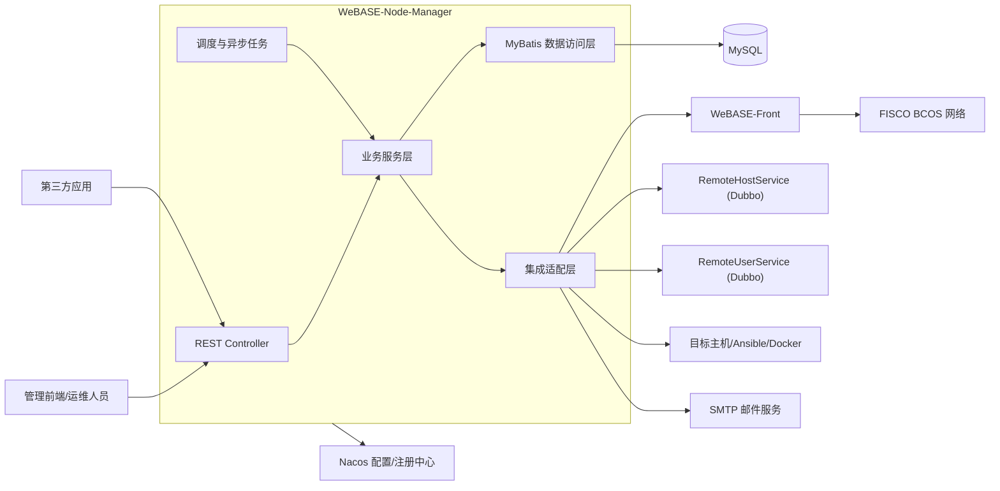
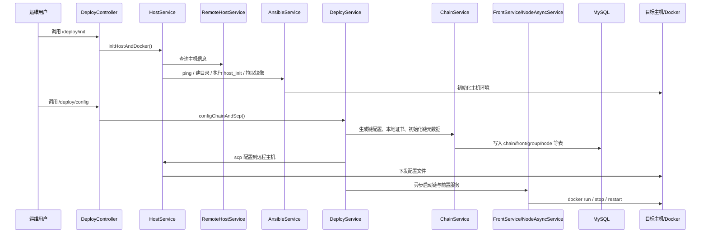
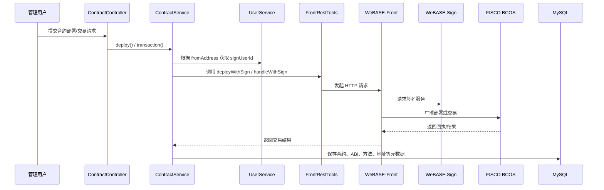
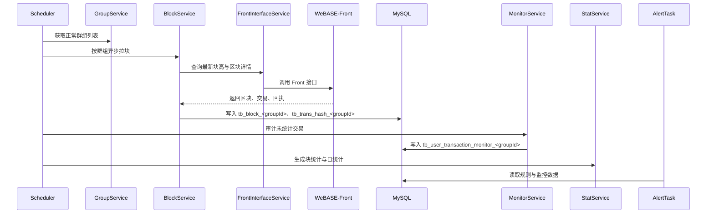
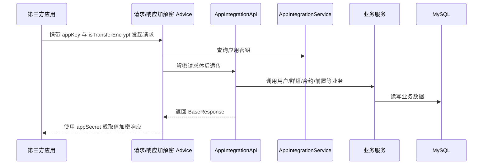

# WeBASE-Node-Manager 系统架构设计

## 简介

### 1.1 文档目的

本文档用于说明 `WeBASE-Node-Manager` 的系统架构、模块边界、数据组织方式、服务交互机制与关键技术实现，为后续详细设计、功能扩展、运维部署和系统联调提供统一依据。

### 1.2 适用范围

本文档适用于以下场景：

- WeBASE 节点管理服务的建设、维护与迭代
- 链、群组、节点、前置服务的可视化部署与运行管理
- 合约、账户、证书、权限治理、监控告警等子系统的协同设计
- 第三方业务系统与节点管理服务的接口集成

### 1.3 参考依据

- 项目源码目录：`src/main/java/com/webank/webase/node/mgr`
- 项目配置文件：`src/main/resources/application.yml`
- 数据库脚本：`script/webase-ddl.sql`
- 启动与部署脚本：`script/`、`script/deploy/`
- 项目说明：`README.md`
- 构建配置：`build.gradle`

### 1.4 系统背景

`WeBASE-Node-Manager` 是 WeBASE 体系中的节点管理后端服务，承担前端管理页面和第三方系统的大部分管理类 Web 请求处理。系统围绕 FISCO BCOS 区块链网络提供以下能力：

- 链、机构、主机、节点、群组、前置服务的生命周期管理
- 合约源码、ABI、部署、交易、CNS、仓库与脚手架管理
- 链上用户、外部账户、证书与私钥相关管理
- 区块、交易、事件、统计、性能和审计监控
- 权限预编译、链治理、资源与节点告警
- 第三方应用接入与应用级加解密通信

该系统是一个“单体业务服务 + 多外部集成”的后端中台，内部采用模块化分层设计，外部对接 Nacos、Dubbo 服务、WeBASE-Front、远程主机、Docker 与邮件系统。

## 总体设计原则

### 2.1 业务集中、模块解耦

系统以单体 Spring Boot 服务承载节点管理核心能力，但在代码层面按业务域拆分为部署、群组、节点、合约、用户、监控、告警、预编译治理、应用集成等模块，降低变更耦合度。

### 2.2 链访问统一抽象

系统不直接在大多数业务场景中访问链节点，而是统一通过 `FrontRestTools`、`FrontInterfaceService` 调用 WeBASE-Front 暴露的 HTTP 接口，形成链访问适配层，屏蔽底层链节点细节。

### 2.3 配置驱动与环境解耦

系统运行参数采用“本地基础配置 + Nacos 远程配置”的方式统一管理，服务名、数据源、公共配置和运行时密钥均支持外部化，避免业务代码与环境参数耦合。

### 2.4 元数据持久化与链上数据增量同步并重

系统将链、群组、节点、合约、账户、应用、规则等管理元数据落库保存，同时通过定时任务持续从链侧拉取区块、交易、事件和统计数据，形成“管理元数据 + 链上镜像数据”的双层数据体系。

### 2.5 自动化运维优先

系统将链部署、节点扩缩容、容器启停、证书分发、远程初始化等操作纳入服务编排，优先通过 Ansible、Docker、SSH、模板渲染与脚本执行实现自动化闭环。

### 2.6 安全与审计并行

系统采用 Sa-Token 权限校验、系统用户 Dubbo 校验、链上签名用户映射、异常交易监控、告警规则和操作日志等手段，兼顾权限控制、业务审计与安全治理。

### 2.7 异步化与并行处理

对拉块、交易审计、统计、主机初始化、节点部署等耗时操作采用线程池、定时任务和异步编排，避免管理接口被长耗时链路阻塞。

## 整体架构设计

### 3.1 架构定位

系统整体采用分层单体架构，部署形态为独立 Spring Boot 服务，向上提供 REST API，向下连接数据库、配置中心、链前置服务、远程主机服务和系统用户服务。其本质上是 WeBASE 平台中的“节点管理与链运维中枢”。

### 3.2 逻辑分层

- 接入层：Controller、统一响应对象、参数校验、异常处理、OpenAPI 标注
- 业务层：按领域拆分的 Service，承载部署、合约、账户、治理、监控等核心业务
- 集成层：Dubbo、RestTemplate、邮件、Docker、Ansible、SSH、模板引擎、文件系统
- 数据层：MyBatis Mapper、Mapper XML、SQL Provider、动态分组表
- 调度层：定时任务、异步线程池、后台拉取与监控任务

### 3.3 总体组件关系

### 3.4 部署与运行模式

- 服务端口默认使用 `5001`
- 应用名称为 `bcos-node-mgr`
- 默认运行 profile 为 `prod`
- 通过 Nacos 导入 `application-common.yml`、`datasource.yml` 及 `${spring.application.name}.yml`
- 既支持本地命令行运行，也支持容器化运行
- 对链节点及前置服务的管理既支持非 Docker 模式，也支持 Docker 模式

### 3.5 主要外部依赖

- WeBASE-Front：区块、交易、事件、权限治理、签名与密钥管理的统一链访问入口
- FISCO BCOS：目标区块链网络
- Nacos：配置中心与服务发现
- Dubbo 系统服务：远程主机信息、系统用户信息
- Docker/Ansible/SSH：远程部署与运维执行环境
- MySQL：业务与链镜像数据存储
- SMTP：告警邮件发送

## 数据中心设计

### 4.1 数据组织总体思路

系统数据分为四类：

- 平台管理元数据
- 链上资源与治理数据
- 运行监控与统计数据
- 按群组隔离的区块交易镜像数据

其中，静态和半静态管理数据采用固定表存储；高增长的链上区块、交易和监控数据采用“按群组动态建表”的方式进行逻辑分区。

### 4.2 核心数据域划分

| 数据域 | 代表数据表 | 说明 |
| --- | --- | --- |
| 链与部署元数据 | `tb_chain`、`tb_agency`、`tb_host`、`tb_front`、`tb_front_group_map`、`tb_group`、`tb_node`、`tb_config` | 描述链、机构、主机、节点、前置服务、群组和部署配置 |
| 合约与链上资源 | `tb_contract`、`tb_abi`、`tb_method`、`tb_cns`、`tb_contract_path`、`tb_contract_store` | 描述合约源码、ABI、方法、部署地址、CNS 和合约仓储 |
| 用户与证书 | `tb_user`、`tb_cert`、`tb_external_account`、`tb_external_contract` | 描述链上用户、公私钥映射、证书信息和外部识别对象 |
| 权限与治理 | `tb_govern_vote` | 记录链治理投票或治理操作数据 |
| 监控与统计 | `tb_trans_daily`、`tb_stat`、`tb_alert_rule`、`tb_mail_server_config`、`tb_alert_log` | 支撑统计分析、规则配置和告警记录 |
| 应用集成 | `tb_app_info` | 管理第三方应用注册、密钥和接入状态 |
| 预置仓库 | `tb_warehouse`、`tb_contract_folder`、`tb_contract_item` | 支撑合约仓库、模板和预置内容 |
| 系统基础 | `tb_account_info`、`tb_role`、`tb_token` | 历史账号与令牌数据，当前部分能力已由统一系统框架接管 |

### 4.3 动态分组表设计

系统通过 `TableName` 与 `TableService` 为每个群组动态创建以下表：

- `tb_block_<groupId>`：保存群组区块镜像
- `tb_trans_hash_<groupId>`：保存群组交易摘要
- `tb_user_transaction_monitor_<groupId>`：保存群组交易审计与异常监控数据

该设计的价值在于：

- 将高增长链数据与平台管理元数据分离
- 以群组为粒度进行逻辑隔离，降低大表竞争
- 便于群组删除时做针对性数据回收

### 4.4 数据来源与流向

| 数据类别 | 来源 | 落库方式 | 消费模块 |
| --- | --- | --- | --- |
| 链部署元数据 | 部署请求、远程主机服务 | 事务写入固定表 | 部署、前置、群组、节点 |
| 区块与交易 | WeBASE-Front 定时拉取 | 动态表增量写入 | 区块、交易、统计、监控 |
| 合约与 ABI | 页面录入、应用导入、链上地址绑定 | 固定表写入 | 合约、方法、事件、监控 |
| 用户与私钥映射 | WeBASE-Front/WeBASE-Sign 返回 | 固定表写入 | 用户、权限治理、交易签名 |
| 监控分析结果 | 审计任务计算 | 动态监控表写入 | 监控、告警 |
| 应用接入信息 | 应用管理与注册接口 | 固定表写入 | 应用集成 API |

### 4.5 数据生命周期管理

- 群组创建时同步创建对应动态表
- 群组删除时清理映射关系，并删除分组动态表
- 区块与交易数据按增量持续拉取，起始块高由本地最新块高与初始化策略共同决定
- 告警日志、监控数据、统计数据通过定时任务执行保留和清理
- 仓库预置数据在应用启动时由 `WarehouseStartupRunner` 自动初始化

## 应用中心设计

### 5.1 应用中心总体说明

应用中心由多个领域子系统构成，各子系统以独立 package 组织，通过 Service 进行编排，既支持前端管理界面，也支持第三方业务系统调用。

### 5.2 业务子系统划分

| 子系统 | 主要包路径 | 功能说明 |
| --- | --- | --- |
| 链与部署管理 | `deploy`、`deploy.chain`、`deploy.service`、`front` | 主机初始化、镜像检查、配置生成、链部署、节点扩缩容、容器启停 |
| 群组与节点管理 | `group`、`node`、`frontgroupmap` | 群组生成、启停、状态查询、节点详情、群组映射缓存 |
| 合约管理 | `contract`、`contract.abi`、`contract.scaffold`、`contract.warehouse`、`method` | 合约源码、ABI、部署、交易、CNS、脚手架、仓库、方法解析 |
| 用户与证书管理 | `user`、`cert`、`external` | 用户创建绑定、私钥导入导出、证书拉取导入、外部账户/合约识别 |
| 区块链数据浏览 | `block`、`transaction`、`event`、`statistic`、`performance` | 区块、交易、事件日志、统计分析和性能查询 |
| 审计监控 | `monitor`、`transdaily` | 异常交易分析、用户/合约监控、每日交易统计 |
| 预编译与治理 | `precompiled`、`precompiled.permission`、`precompiled.sysconf` | CNS、共识节点管理、CRUD、合约状态、权限、委员会、阈值治理 |
| 告警中心 | `alert.rule`、`alert.log`、`alert.mail`、`alert.task` | 告警规则、邮件配置、日志、节点/资源/证书/审计告警 |
| 应用集成 | `appintegration`、`appintegration.api` | 第三方应用管理、应用注册、加解密通信、应用合约导入 |
| 基础设施 | `base`、`config`、`tools` | 公共响应、异常、配置、工具、模板、命令执行 |

### 5.3 模块协作关系

- `deploy` 模块协调 `chain`、`front`、`group`、`node`、`host`、`cert`
- `contract` 模块依赖 `user`、`abi`、`method`、`monitor`、`front`
- `group` 模块依赖 `front`、`node`、`table`、`block`、`statistic`
- `monitor` 模块依赖 `transaction`、`contract`、`user`、`abi`、`front`
- `precompiled` 模块依赖 `user`、`front`、`governvote`
- `appintegration` 模块横向调用 `group`、`node`、`user`、`contract`、`front`

### 5.4 对外服务方式

系统主要通过 REST API 对外服务，接口分为两类：

- 面向管理前端和运维用户的管理型接口，如 `/deploy/**`、`/group/**`、`/contract/**`
- 面向第三方系统的集成型接口，如 `/api/**`

接口层统一使用 `BaseResponse`、`BasePageResponse` 返回结果，统一通过 `ExceptionsHandler` 做异常封装。

## 服务交互流程设计

### 6.1 链与节点部署流程

该流程涵盖主机初始化、链配置生成、文件分发和异步启动。

### 6.2 合约部署与交易流程

合约管理通过 WeBASE-Front 统一完成签名、部署与交易发送，并将合约元数据、ABI 和方法信息回写本地数据库。

### 6.3 区块拉取与审计监控流程

系统通过定时任务周期性拉取增量区块，并基于交易信息生成监控和统计结果。

### 6.4 第三方应用接入流程

第三方应用通过 `/api/**` 接口访问节点管理能力，支持应用注册、信息查询、用户管理和合约导入等。

## 技术架构设计

### 7.1 技术分层结构

| 层次 | 主要技术/组件 | 说明 |
| --- | --- | --- |
| 接口层 | Spring MVC、`@RestController`、JSR-303 校验 | 暴露 REST 接口并统一处理参数 |
| 业务层 | Spring Service、事务、AOP、异步任务 | 封装业务编排与领域逻辑 |
| 调度层 | `@Scheduled`、`ThreadPoolTaskScheduler`、`ThreadPoolTaskExecutor` | 支撑周期任务与并发执行 |
| 数据访问层 | MyBatis、Mapper XML、SQL Provider | 访问固定表和动态表 |
| 链适配层 | RestTemplate、WeBASE-Front API、FISCO BCOS SDK 类型 | 统一处理链访问和数据映射 |
| 微服务集成层 | Dubbo、Nacos、Redisson、Sa-Token | 对接外部平台能力与配置体系 |
| 运维执行层 | Docker、Ansible、SSH、Shell、Thymeleaf 模板 | 生成部署文件并执行远程操作 |

### 7.2 核心技术构成

- 应用框架：Spring Boot 2.7.10
- 语言版本：Java 8
- 持久层：MyBatis + Mapper XML + SQL Provider
- 链 SDK：`org.fisco-bcos.java-sdk:2.9.2`
- 配置与注册：Nacos
- 服务治理：Dubbo 3.1.8
- 权限框架：Sa-Token
- 连接池：HikariCP
- 日志：Log4j2
- 邮件：JavaMailSender + Thymeleaf 模板
- 容器运维：Docker Java、Ansible、JSch

### 7.3 配置与线程模型

- `Application` 开启异步、调度、事务和 AOP
- `ThreadPoolConfig` 提供 `mgrAsyncExecutor`、`mgrTaskScheduler`、`deployAsyncScheduler`
- `SchedulerPoolConfig` 将调度任务绑定到统一线程池
- `BeanConfig` 区分普通 HTTP 超时与合约部署超时的 `RestTemplate`

### 7.4 链访问与路由机制

系统通过 `FrontRestTools` 和 `FrontInterfaceService` 完成链访问抽象，具备以下特征：

- 按 `groupId` 自动拼装 WeBASE-Front URI
- 使用 `FrontGroupMapCache` 优先选择共识节点对应前置服务
- 记录前置服务失败次数并在阈值内进入休眠窗口，避免持续击穿异常节点
- 将当前 Sa-Token token 透传给 WeBASE-Front，形成跨服务鉴权传递

### 7.5 远程部署技术路径

部署能力采用“主机元数据服务 + 远程执行引擎 + 本地模板生成”的组合模式：

- 主机信息由 `RemoteHostService` 提供
- 远程命令由 `AnsibleService`、`DockerCommandService`、`SshTools` 负责执行
- 节点与前置配置由 `ThymeleafUtil` 基于模板文件渲染
- 目录结构、节点根路径、容器名称由 `PathService` 和部署服务统一计算

## 关键技术研发

### 8.1 基于 WeBASE-Front 的统一链访问抽象

系统没有将每个业务模块直接耦合到链 SDK，而是统一通过 Front 接口访问链能力，既复用了 WeBASE-Sign 的签名托管能力，也让节点管理服务能够集中处理 URI 规则、token 透传、失败熔断和随机前置路由。

### 8.2 群组级动态分表

通过 `tb_block_<groupId>`、`tb_trans_hash_<groupId>`、`tb_user_transaction_monitor_<groupId>` 实现链镜像数据的群组隔离，是本系统在大规模链数据场景下的关键设计点。该方案比全部写入固定大表更便于扩展和清理。

### 8.3 自动化链部署闭环

系统将主机检查、镜像检测、配置生成、证书生成、文件分发、容器启动、节点状态刷新整合到单一后端流程中，形成从“资源准备”到“链启动”的自动化闭环，显著降低人工部署复杂度。

### 8.4 链上账户与签名服务桥接

用户、合约部署和治理操作都依赖 `signUserId` 与链上地址的映射关系。系统通过 `UserService` 调用 WeBASE-Front/WeBASE-Sign 完成密钥导入、生成、导出与签名身份绑定，是链上账户托管的重要技术支点。

### 8.5 审计监控与异常识别

系统并非仅保存交易记录，而是通过 `MonitorService` 结合 ABI、方法签名、用户与合约画像，对交易进行异常用户、异常合约、接口调用等审计分析，并联动告警系统形成持续监控能力。

### 8.6 第三方应用加解密通信

`/api/**` 接口通过 `DecryptRequestBodyAdvice` 与 `EncryptResponseBodyAdvice` 实现基于 `appSecret` 的对称加解密，使节点管理能力可以较安全地暴露给外部业务系统。

### 8.7 治理与预编译封装

系统对 CNS、CRUD、共识节点、权限、委员会、阈值、账户冻结等治理能力进行了服务化封装，并通过 `GovernVoteService` 持久化治理动作，为联盟链场景下的治理运维提供平台化支持。

## 数据交互机制设计

### 9.1 内部数据交互机制

内部交互遵循“Controller -> Service -> Mapper/Adapter”的标准路径：

- Controller 负责参数接收、权限注解和返回封装
- Service 负责跨模块业务编排
- Mapper 负责数据库访问
- Adapter 负责外部系统调用

### 9.2 与 WeBASE-Front 的交互机制

- 协议：HTTP/REST
- 工具：`RestTemplate`
- 路由：按 `groupId` 与 `frontIp/frontPort` 选择目标 Front
- 鉴权：透传 Sa-Token token 信息
- 交互内容：区块、交易、事件、证书、系统配置、权限治理、签名交易、群组操作

### 9.3 与平台微服务的交互机制

- 与主机服务：Dubbo 调用 `RemoteHostService`
- 与系统用户服务：Dubbo 调用 `RemoteUserService`
- 与配置中心：Nacos 配置拉取与变更监听

### 9.4 与远程主机的交互机制

- 通过 Ansible 执行 ping、目录创建、主机初始化、文件分发、Docker 命令
- 通过 SSH/脚本补充特定远程文件与命令处理
- 通过 Docker 统一拉起 WeBASE-Front 及节点相关容器

### 9.5 数据同步与一致性机制

- 管理元数据写库采用 Spring 事务控制
- 区块与交易数据采用增量拉取，属于最终一致性
- 监控与统计基于已落库交易数据继续异步计算
- 前置服务异常通过失败次数与休眠时间控制，降低雪崩影响
- 群组缓存通过 `FrontGroupMapCache` 定期刷新，保证链路可用性

### 9.6 第三方应用数据共享机制

- 应用先在 `tb_app_info` 完成注册和密钥分发
- 业务调用通过 `/api/**` 完成
- 请求体与响应体可按 `isTransferEncrypt` 配置启用 AES 加解密
- 应用状态通过异步任务巡检，异常应用可被标记为失效

### 9.7 安全交互说明

当前源码显示：

- 管理端权限控制以 `@SaCheckPermission`、`LoginHelper`、系统公共安全组件为主
- 链路中的第三方应用加解密 Advice 处于启用状态
- 历史 `Spring Security` 与部分 `WebMvc` 拦截注册代码仍保留，但当前实现中存在注释停用的情况

因此，现阶段架构上应认定系统安全能力依赖上层统一认证框架与 Sa-Token 体系，而不是依赖本仓内的旧版 Spring Security 配置。

## 技术体系

### 10.1 客户端技术体系

本仓库不包含前端页面源码，但从接口设计与系统角色看，客户端体系包含：

- WeBASE 管理前端页面
- 运维/管理人员调用的浏览器端或网关侧客户端
- 第三方业务系统客户端

客户端通过 HTTP/JSON 与本服务交互，并可通过应用集成接口使用加密通信。

### 10.2 服务端技术体系

| 维度 | 技术选型 |
| --- | --- |
| 开发语言 | Java 8 |
| 应用框架 | Spring Boot 2.7.10 |
| Web 层 | Spring MVC |
| 持久层 | MyBatis、MyBatis Generator、MyBatis Plus（依赖已集成） |
| 权限认证 | Sa-Token、平台公共安全组件 |
| 微服务集成 | Dubbo、Nacos |
| 链交互 | WeBASE-Front REST、FISCO BCOS Java SDK |
| 缓存/分布式能力 | Redisson |
| 日志 | Log4j2 |
| 邮件 | JavaMailSender、Thymeleaf |
| 远程运维 | Docker、Ansible、JSch、Shell |
| 构建工具 | Gradle |

### 10.3 运行环境

- JDK 1.8
- MySQL 8.x 兼容环境
- Nacos 配置中心
- Dubbo 服务注册与调用环境
- Docker 运行环境
- 支持 Ansible/SSH 的远程 Linux 主机

## 架构特点

### 11.1 架构优势

- 管理能力集中：一个服务统一覆盖部署、链治理、合约、用户、监控和告警
- 模块边界清晰：按领域拆包，便于维护和扩展
- 链访问统一：通过 WeBASE-Front 形成稳定适配层
- 部署自动化程度高：支持从主机初始化到容器运行的全流程编排
- 数据组织合理：固定元数据表与群组动态表结合，兼顾管理性与扩展性
- 可观测性较强：内置统计、性能、审计、告警和日志闭环
- 生态集成度高：与 Nacos、Dubbo、WeBASE-Front、WeBASE-Sign、Docker 等组件形成协同

### 11.2 设计特点

- 采用“平台管理元数据 + 链上镜像数据 + 后台分析数据”的三层数据模型
- 采用“同步接口处理 + 异步任务拉取/分析 + 定时规则驱动”的运行模式
- 采用“本地生成配置 + 远程执行部署”的混合运维架构
- 采用“业务模块化单体 + 外部服务协同”的平台中台架构

### 11.3 适应性与发展潜力

当前架构适合以下演进方向：

- 继续扩展多链、多群组和多机构管理能力
- 将高耦合模块逐步拆分为独立微服务
- 将动态分表升级为更标准化的分区或时序存储方案
- 增强第三方接口的签名校验和零信任接入能力
- 对部署与监控链路引入更完善的任务编排与可视化运维能力
