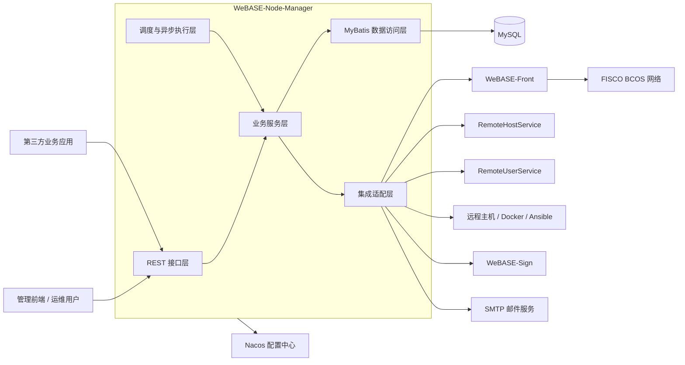
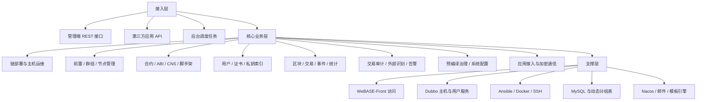
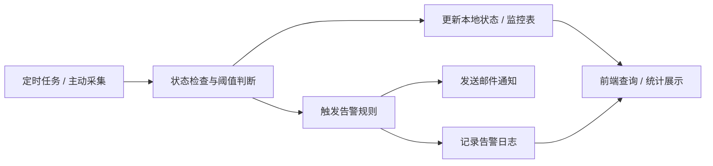

# WeBASE-Node-Manager 系统概要设计

## 简介

### 1.1 文档目的

本文档用于对 `WeBASE-Node-Manager` 的系统整体方案进行概要设计说明，明确系统建设目标、总体架构、数据组织、功能划分、基础能力、监控机制和安全策略，为后续详细设计、开发实现、联调测试和运维部署提供统一依据。

### 1.2 适用范围

本文档适用于以下场景：

- WeBASE 节点管理服务的新建、迁移、升级和维护
- FISCO BCOS 链、群组、节点、前置服务的部署与运行管理
- 合约、用户、证书、权限治理、交易审计、告警监控等能力建设
- 第三方业务系统通过开放接口接入节点管理能力

### 1.3 编写依据

- 项目源码：`src/main/java/com/webank/webase/node/mgr`
- 配置文件：`src/main/resources/application.yml`
- 数据库脚本：`script/webase-ddl.sql`
- 构建文件：`build.gradle`
- 部署脚本：`script/deploy/*`
- 项目说明：`README.md`

### 1.4 建设背景与目标

`WeBASE-Node-Manager` 是 WeBASE 体系中的节点管理后端服务，负责承接管理前端和第三方应用的大部分管理类请求，统一管理区块链网络中的链、群组、节点、前置服务、用户、证书、合约和监控告警信息。

系统建设目标如下：

- 形成面向 FISCO BCOS 网络的统一节点管理中台
- 打通链部署、节点启停、群组维护、前置服务治理等运维链路
- 建立链上数据拉取、统计分析、异常审计和告警通知机制
- 提供合约管理、用户私钥管理、证书管理和权限治理能力
- 提供面向第三方应用的标准化开放接口和应用级数据加密能力

## 总体设计

### 2.1 总体设计目标

系统采用“单体服务承载核心业务、模块化分层解耦、外部服务协同集成”的总体设计思路，在一个 Spring Boot 应用内整合节点管理核心能力，并通过 Nacos、Dubbo、WeBASE-Front、Docker、Ansible、SMTP 等外部能力完成分布式协同。

总体目标包括：

- 对外提供统一 REST 服务入口
- 对内按业务域拆分模块，降低代码耦合
- 通过前置服务统一访问链节点，隔离底层链通信细节
- 通过数据库保存管理元数据和链上镜像数据
- 通过调度与异步机制提升批量运维和持续拉取场景的处理效率

### 2.2 关键设计原则

- 统一接入原则：前端页面、运维请求和第三方调用统一通过 Node-Manager 接入
- 分层解耦原则：接口层、业务层、集成层、数据层、调度层职责清晰
- 配置外置原则：运行参数通过本地配置与 Nacos 远程配置组合管理
- 数据分域原则：平台元数据、链上镜像数据、监控数据、告警数据分域存储
- 自动化运维原则：主机初始化、链配置、文件分发、节点启停优先自动化执行
- 安全可控原则：权限校验、参数校验、敏感信息控制、审计告警并行设计

### 2.3 技术架构与分层

系统主要技术栈如下：

- 开发框架：Spring Boot 2.7.10
- 数据访问：MyBatis、MyBatis-Plus
- 链接入 SDK：FISCO BCOS Java SDK 2.9.2
- 权限认证：Sa-Token
- 配置与注册：Spring Cloud Alibaba Nacos
- 服务协同：Apache Dubbo 3
- 远程运维：Ansible、SSH、Docker
- 模板与邮件：Thymeleaf、JavaMail
- 日志体系：Log4j2

逻辑分层如下：

- 接入层：各业务 `Controller`，统一处理参数、权限、响应和异常
- 业务层：`Service` 按领域编排链部署、群组、节点、合约、用户、监控等业务
- 集成层：`FrontRestTools`、Dubbo、Ansible、Docker、SMTP、文件系统等适配能力
- 数据层：`Mapper`、Mapper XML、SQL Provider、动态分组表
- 调度层：定时任务、线程池、异步任务、缓存刷新和后台统计

### 2.4 总体架构图

### 2.5 服务划分策略

基于当前源码，系统按业务域划分为以下核心子系统：

- 链部署与主机运维：`deploy`、`deploy.chain`、`deploy.service`
- 前置服务、群组、节点管理：`front`、`group`、`node`、`frontgroupmap`
- 合约与仓库管理：`contract`、`contract.abi`、`contract.scaffold`、`contract.warehouse`
- 用户、证书、外部识别：`user`、`cert`、`external`
- 区块、交易、事件、统计：`block`、`transaction`、`event`、`statistic`、`performance`
- 交易审计与异常监控：`monitor`、`transdaily`
- 预编译治理与系统配置：`precompiled`、`precompiled.permission`、`precompiled.sysconf`、`configapi`
- 告警与通知：`alert.rule`、`alert.log`、`alert.mail`、`alert.task`
- 应用集成：`appintegration`、`appintegration.api`

### 2.6 运行环境设计

硬件与部署建议如下：

- 管理服务节点：部署 Spring Boot 应用，建议与 Nacos、MySQL、SMTP 保持稳定内网连通
- 数据库节点：部署 MySQL，用于保存平台元数据、镜像数据、告警和统计数据
- 区块链主机节点：部署 FISCO BCOS 节点、WeBASE-Front、WeBASE-Sign，可采用 Docker 或命令行方式运行
- 运维控制环境：具备 Ansible、Shell、SSH、Docker 远程执行能力

当前代码体现的运行特征如下：

- 服务默认端口为 `5001`
- 应用名为 `bcos-node-mgr`
- 默认 profile 为 `prod`
- 通过 Nacos 加载 `application-common.yml`、`datasource.yml` 和 `bcos-node-mgr.yml`
- 支持异步线程池和定时调度线程池并行执行后台任务

### 2.7 软件选型标准

软件选型遵循以下标准：

- 选择 Spring Boot 构建统一后端运行时，降低运维复杂度
- 选择 MyBatis 直连 SQL，便于动态表、定制查询和链镜像数据处理
- 选择 WeBASE-Front 作为链访问统一代理，避免业务服务直接连接链节点
- 选择 Dubbo 对接统一主机服务和统一系统用户服务，减少重复建设
- 选择 Docker 与 Ansible 组合实现跨主机、跨节点的自动化部署与运维

### 2.8 网络结构与分布式协同机制

系统在网络上分为管理域、服务域和链运行域：

- 管理域：浏览器、第三方应用访问 Node-Manager 暴露的 HTTP 接口
- 服务域：Node-Manager 访问 Nacos、MySQL、Dubbo 服务、SMTP
- 链运行域：Node-Manager 通过 WeBASE-Front 访问区块链网络，并通过 Ansible/SSH/Docker 管理远程主机

分布式协同机制如下：

- 配置协同：依赖 Nacos 统一管理环境配置和服务地址
- 账户协同：通过 `RemoteUserService` 获取统一系统用户信息
- 主机协同：通过 `RemoteHostService` 获取和更新主机元数据
- 链访问协同：通过 `FrontInterfaceService` 和 `FrontRestTools` 访问 WeBASE-Front
- 运维协同：通过 `NodeAsyncService`、`HostService` 和 `DeployService` 协调多主机并行执行

## 数据中心设计

### 3.1 数据中心总体架构

系统数据中心采用“管理元数据 + 链上镜像数据 + 统计监控数据 + 告警通知数据”四层组织方式：

- 管理元数据：链、机构、主机、前置、群组、节点、应用、配置等静态或半静态数据
- 链上镜像数据：区块、交易、监控明细等按群组拆分的增量数据
- 统计监控数据：交易日报、统计指标、异常审计结果
- 告警通知数据：告警规则、邮件服务器配置、告警日志

### 3.2 核心数据域设计

| 数据域 | 代表数据表 | 设计说明 |
| --- | --- | --- |
| 链与部署域 | `tb_chain`、`tb_agency`、`tb_host`、`tb_front`、`tb_front_group_map`、`tb_group`、`tb_node`、`tb_config` | 管理链、机构、主机、前置、群组、节点与镜像配置 |
| 合约与方法域 | `tb_contract`、`tb_abi`、`tb_method`、`tb_contract_path`、`tb_cns`、`tb_contract_store` | 保存合约源码、ABI、方法解析、路径结构、CNS 和应用合约资料 |
| 用户与证书域 | `tb_user`、`tb_cert`、`tb_external_account`、`tb_external_contract` | 保存链用户、公钥索引、证书、外部账户与外部合约识别信息 |
| 应用集成域 | `tb_app_info` | 保存第三方应用注册、密钥、状态和接入资料 |
| 监控统计域 | `tb_trans_daily`、`tb_stat`、`tb_govern_vote` | 保存日报、统计指标和治理投票记录 |
| 告警域 | `tb_alert_rule`、`tb_mail_server_config`、`tb_alert_log` | 保存告警规则、SMTP 配置和发送日志 |
| 合约仓库域 | `tb_warehouse`、`tb_contract_folder`、`tb_contract_item` | 保存预置仓库、目录和示例合约内容 |
| 账号兼容域 | `tb_account_info`、`tb_role`、`tb_token` | 保留历史账号与令牌结构，部分能力已迁移到统一系统框架 |

### 3.3 多源数据接入机制

系统的数据来源主要包括：

- 前端管理操作：通过各 Controller 写入链、群组、合约、用户等元数据
- 第三方应用接入：通过 `/api/**` 和应用管理接口写入应用、合约、用户信息
- WeBASE-Front 拉取：区块、交易、事件、节点状态、治理信息、证书和性能数据
- 远程主机服务：主机清单、主机状态、主机资源信息
- 后台任务计算：监控分析、统计汇总、告警结果
- 资源文件初始化：启动时从 `resources/warehouse/*.json` 初始化预置合约仓库

### 3.4 动态分组数据表设计

系统对高增长链数据采用按群组动态建表策略。`TableService` 在群组创建或同步时生成以下数据表：

- `tb_block_<groupId>`：保存区块镜像数据
- `tb_trans_hash_<groupId>`：保存交易摘要与状态数据
- `tb_user_transaction_monitor_<groupId>`：保存审计监控明细

该设计带来的收益如下：

- 以群组维度隔离高增长数据，降低大表竞争
- 支持按群组拉取、统计和清理数据
- 便于群组删除时执行针对性数据回收

### 3.5 数据处理与共享策略

系统围绕链上数据处理采用以下策略：

- 增量拉取：通过 `PullBlockTransTask` 持续拉取新区块和交易数据
- 解析加工：将区块、交易、ABI、方法签名、事件日志、异常信息解析为可查询结构
- 统计汇总：按群组生成交易日报、链统计信息和趋势数据
- 共享复用：多个业务模块共享同一份本地镜像数据，避免重复访问链节点
- 缓存加速：前置与群组映射通过 `FrontGroupMapCache` 缓存常用映射关系

### 3.6 数据脱敏与敏感信息控制

当前实现中的敏感数据控制策略包括：

- 私钥不直接作为平台普通业务数据落库，平台主要管理链用户元数据与签名服务关联标识
- 第三方应用接口支持基于 `appSecret` 的请求体解密与响应体加密
- 数据库连接信息对外提供时通过编码方式处理密码字段
- 证书内容、SMTP 账号密码、应用密钥等敏感信息仅在受控服务内使用
- 涉及 IP、端口、地址、文件路径等输入均在业务中进行格式校验

### 3.7 数据访问控制设计

数据访问控制采用“接口权限 + 用户角色 + 数据范围”的组合方式：

- 接口侧通过 `@SaCheckPermission` 控制操作权限
- 统一登录用户信息通过 `LoginHelper` 和 Dubbo 用户服务获取
- 查询型操作中使用 `DataPermissionHelper.ignore` 或基于当前角色限制结果集
- 开发者角色在合约、外部合约等查询中按本人账号隔离数据范围

### 3.8 数据生命周期设计

系统对数据生命周期做如下设计：

- 群组创建后同步创建对应动态表
- 群组删除时删除关联节点、映射和动态表
- 区块、交易、监控数据按保留阈值与清理任务定期淘汰
- 告警日志、统计信息、异常监控结果按定时任务逐步归档或清理
- 应用状态由周期任务自动刷新，避免无效接入长期残留

## 业务功能整体概貌设计

### 4.1 服务对象分类

系统主要服务对象如下：

- 平台运维管理员：负责主机初始化、链部署、节点启停、前置管理、证书维护
- 区块链开发人员：负责合约保存、编译、部署、交易发送、CNS 注册和脚手架导出
- 审计与安全人员：负责交易审计、异常账户识别、外部合约识别、告警规则维护
- 治理与系统管理员：负责权限治理、委员会、阈值、冻结解冻、系统配置
- 第三方应用系统：通过开放 API 完成应用注册、群组查询、用户管理和合约资料接入

### 4.2 用户角色与接入方式

系统在当前实现中主要通过以下方式接入：

- 管理前端接入：通过 `/deploy/**`、`/group/**`、`/front/**`、`/contract/**` 等 REST 接口访问
- 第三方应用接入：通过 `/api/**` 接口访问，支持应用注册与可选的请求加解密
- 后台任务接入：通过定时任务自动执行拉块、统计、监控、告警、清理和状态巡检

### 4.3 核心业务流程概览

系统支撑的核心业务流程包括：

- 主机与链部署流程：主机探活、目录校验、环境初始化、生成配置、分发文件、启动节点
- 前置与群组同步流程：刷新前置、同步群组列表、建立前置群组映射、同步节点状态
- 合约管理流程：保存源码、维护 ABI、部署合约、发送交易、注册 CNS、导出脚手架
- 用户与证书流程：创建链用户、导入导出密钥材料、关联签名服务、下载 SDK 证书
- 数据与审计流程：拉取区块交易、统计日报、识别异常用户和异常合约、生成告警

### 4.4 业务整体功能框架图

## 业务功能设计

### 5.1 链部署与主机运维模块

对应模块：`deploy.controller`、`deploy.service`、`deploy.chain`

主要功能如下：

- 主机探活、目录校验、Docker 与端口环境检查
- 主机初始化与镜像拉取
- 链配置生成、节点证书与前置配置生成
- 链启动、停止、重启、删除、升级
- 节点扩容、启动、停止、强制停止、删除

主要操作入口如下：

- `POST /host/ping`
- `POST /host/check`
- `POST /deploy/init`
- `POST /deploy/config`
- `POST /deploy/node/add`
- `POST /deploy/node/start`
- `POST /deploy/node/stop`
- `POST /deploy/upgrade`
- `GET /deploy/chain/start`

设计说明：

- `DeployService` 负责编排“检查主机 -> 校验镜像 -> 生成链配置 -> 分发配置 -> 异步启动链”
- `HostService` 负责远程主机初始化、镜像拉取、目录创建和状态回写
- `NodeAsyncService` 负责跨主机并发启动、重启和状态收敛
- 主机信息由 `RemoteHostService` 统一提供，平台自身不重复维护主机主数据

### 5.2 前置服务、群组与节点管理模块

对应模块：`front`、`group`、`node`、`frontgroupmap`

主要功能如下：

- 刷新前置服务并同步版本、端口、机构、群组和节点信息
- 维护前置与群组映射关系
- 群组查询、详情查看、描述修改、生成、启停、批量启动、删除
- 节点列表查询、节点详情查看、节点状态探测、节点描述维护

主要操作入口如下：

- `GET /front/refresh`
- `POST /front/new`
- `GET /group/all`
- `POST /group/generate`
- `POST /group/operate/{nodeId}`
- `DELETE /group/{groupId}`
- `GET /node/nodeList/{groupId}/{pageNumber}/{pageSize}`
- `GET /node/nodeInfo/{groupId}/{nodeId}`

设计说明：

- `FrontService` 通过 WeBASE-Front 获取群组列表、节点版本、节点配置、前置版本并落库
- `GroupService` 负责群组生命周期和关联数据清理，并在群组层触发动态表创建与删除
- `NodeService` 负责节点状态判断，结合共识状态和同步状态识别失活节点
- `FrontGroupMapCache` 提升前置与群组映射查询效率

### 5.3 合约、ABI、脚手架与仓库模块

对应模块：`contract`、`contract.abi`、`contract.scaffold`、`contract.warehouse`

主要功能如下：

- 合约源码保存、删除、查询和分页管理
- 合约部署、交易发送、方法调用和合约状态维护
- ABI 管理与方法解析
- CNS 注册与查询
- 合约脚手架导出
- 预置合约仓库、目录、合约示例浏览与复制

主要操作入口如下：

- `POST /contract/save`
- `POST /contract/deploy`
- `POST /contract/transaction`
- `POST /contract/contractList`
- `GET /precompiled/cns/list`
- `POST /scaffold/export`
- `GET /warehouse/list`

设计说明：

- `ContractService` 负责合约落库、部署编排和交易发送
- `AbiService`、`MethodService` 将 ABI 解析为方法级结构，供交易审计和事件解析复用
- `ScaffoldService` 按项目参数生成可导出的开发脚手架
- `WarehouseStartupRunner` 在系统启动时自动导入预置仓库数据，形成可复用的示例合约库

### 5.4 用户、证书与私钥索引模块

对应模块：`user`、`cert`

主要功能如下：

- 链用户创建、绑定、更新和分页查询
- 私钥导入、PEM/P12 导入导出、绑定已有私钥
- 证书列表查询、证书导入、证书删除
- 前置 SDK 证书查询与下载压缩包

主要操作入口如下：

- `POST /user/userInfo`
- `POST /user/import`
- `POST /user/importPem`
- `POST /user/exportPem`
- `POST /user/bind/privateKey`
- `GET /cert/list`
- `GET /cert/sdk/{frontId}`
- `GET /cert/sdk/zip/{frontId}`

设计说明：

- 用户管理强调链身份、地址、公钥、签名服务用户标识之间的映射
- 私钥材料的生成、导入导出主要通过 WeBASE-Front/Sign 体系完成
- 证书管理既支撑链节点证书归档，也支撑 SDK 证书下载分发

### 5.5 区块、交易、事件与统计模块

对应模块：`block`、`transaction`、`event`、`statistic`、`performance`

主要功能如下：

- 区块列表、区块详情、区块头、区块/交易搜索
- 交易列表、交易详情、回执查询、消息签名
- 新块事件、合约事件、事件日志查询
- 链统计、趋势分析和节点监控信息查询
- 前置性能、资源配置和资源消耗查询

主要操作入口如下：

- `GET /block/blockList/{groupId}/{pageNumber}/{pageSize}`
- `GET /transaction/transList/{groupId}/{pageNumber}/{pageSize}`
- `GET /transaction/transactionReceipt/{groupId}/{transHash}`
- `POST /event/eventLogs/list`
- `GET /stat`
- `GET /stat/chain`
- `GET /chain/monitorInfo/{frontId}`
- `GET /performance/ratio/{frontId}`

设计说明：

- 链上数据优先从本地镜像表查询，查无结果时再补查链上数据
- 事件数据通过 WeBASE-Front 的事件接口实时获取
- 统计模块既提供汇总结果，也为首页、监控和告警提供基础数据

### 5.6 交易审计、外部识别与异常分析模块

对应模块：`monitor`、`external`、`transdaily`

主要功能如下：

- 用户交易审计、接口审计、交易明细查询
- 异常用户和异常合约识别
- 外部账户和外部合约信息管理
- 每日交易统计与趋势计算

主要操作入口如下：

- `GET /monitor/userList/{groupId}`
- `GET /monitor/interfaceList/{groupId}`
- `GET /monitor/transList/{groupId}`
- `GET /monitor/unusualUserList/{groupId}/{pageNumber}/{pageSize}`
- `GET /external/account/list/{groupId}/{pageNumber}/{pageSize}`
- `GET /external/contract/list/all/{groupId}/{pageNumber}/{pageSize}`

设计说明：

- `MonitorService` 基于交易哈希、ABI、方法签名、用户与合约元数据对交易进行持续分析
- 审计结果沉淀到群组级监控表中，支撑后续查询和告警
- `ExtAccountService`、`ExtContractService` 负责识别和沉淀外部地址、外部合约信息

### 5.7 预编译治理与系统配置模块

对应模块：`precompiled`、`precompiled.permission`、`precompiled.sysconf`、`configapi`

主要功能如下：

- 共识节点和观察节点管理
- CNS、CRUD、合约状态管理
- 委员会成员管理、权重管理、阈值管理、操作员管理
- 地址冻结与解冻
- 系统配置查询与更新
- 服务版本、加密类型、服务器 IP/端口、部署配置查询

主要操作入口如下：

- `GET /precompiled/consensus/list`
- `POST /precompiled/consensus`
- `POST /precompiled/crud`
- `POST /precompiled/contract/status`
- `GET /governance/committee/list`
- `PUT /governance/threshold`
- `POST /sys/config`
- `GET /config/version`
- `GET /config/list`

设计说明：

- 预编译治理能力统一通过 WeBASE-Front 透传链治理接口实现
- 系统配置接口同时承担运行信息暴露和部署配置查询能力
- 治理记录落地到 `tb_govern_vote`，便于后续审计和检索

### 5.8 告警与通知模块

对应模块：`alert.rule`、`alert.log`、`alert.mail`、`alert.task`

主要功能如下：

- 默认告警规则查询、修改与启停
- SMTP 配置管理和测试发送
- 告警日志留存
- 节点状态、CPU、内存、证书、审计异常等告警触发

主要操作入口如下：

- `GET /alert/list`
- `PUT /alert`
- `PUT /alert/toggle`
- `GET /mailServer/config/list`
- `POST /alert/mail/test/{toMailAddress}`
- `GET /log/list/{pageNumber}/{pageSize}`

设计说明：

- `MailService` 采用数据库配置动态刷新 SMTP 参数，并使用 Thymeleaf 模板生成邮件正文
- 告警规则支持启停、阈值、接收人、告警间隔配置
- 告警日志落库，保证告警链路可审计、可追踪

### 5.9 第三方应用集成模块

对应模块：`appintegration`、`appintegration.api`

主要功能如下：

- 第三方应用登记、密钥分配、状态维护、删除
- 应用注册回调与状态巡检
- 面向外部系统提供基础信息、群组、节点、用户、合约相关开放接口
- 请求体解密和响应体加密

主要操作入口如下：

- `POST /app/save`
- `GET /app/list`
- `DELETE /app/{id}`
- `POST /api/appRegister`
- `GET /api/basicInfo`
- `GET /api/groupList`

设计说明：

- `AppIntegrationService` 为每个应用生成 `appKey` 和 `appSecret`
- `DecryptRequestBodyAdvice` 与 `EncryptResponseBodyAdvice` 对 `/api/**` 实现应用级 AES 加解密
- `AppStatusCheckTask` 周期性检查外部应用联通状态，自动更新应用状态

## 基础功能设计

### 6.1 用户权限体系设计

系统采用统一登录用户体系与细粒度权限控制结合的方式：

- 登录用户由统一系统服务维护，Node-Manager 通过 Dubbo 获取用户信息
- 接口权限通过 `@SaCheckPermission` 标注到控制器方法
- 角色粒度区分系统管理员、开发者等角色
- 部分查询接口结合当前登录人角色控制数据可见范围
- 数据权限辅助能力通过 `DataPermissionHelper` 参与结果集控制

### 6.2 安全认证机制设计

当前实现中的认证与鉴权机制如下：

- Sa-Token 作为统一会话与权限校验组件
- 控制器按业务权限点进行拦截，例如 `bcos:chain:initHost`、`bcos:contract:ide`
- 应用开放接口通过 `appKey` 和 `appSecret` 进行接入识别
- 应用开放接口支持可选的请求加密、响应加密机制
- Node-Manager 调用 WeBASE-Front 时可透传当前会话 Token，保持上下游鉴权一致性

### 6.3 信息交互界面设计

系统统一采用 RESTful 风格接口，对外提供：

- 管理类接口：面向运维和前端页面
- 集成类接口：面向第三方系统和应用
- 查询类接口：返回统一 `BaseResponse` 或 `BasePageResponse`

接口层统一特征如下：

- 使用参数校验注解和 `BindingResult` 做输入检查
- 使用 `BaseController` 统一封装公共校验逻辑
- 使用 `ExceptionsHandler` 统一处理业务异常、参数异常和运行时异常
- 通过 `springdoc-openapi` 与 `@Tag` 注解组织接口文档标签

### 6.4 消息系统设计

系统内置邮件型消息通知机制，设计如下：

- 告警规则定义消息触发条件、接收人、间隔和内容模板
- 邮件服务器配置存储在数据库，可在线更新并动态生效
- 邮件正文基于 Thymeleaf 模板渲染
- 发送结果同步记录到告警日志表，形成完整通知闭环

### 6.5 敏感数据保护设计

系统对敏感信息采用分类控制：

- 应用开放接口敏感报文采用 AES 加解密
- 私钥主要通过前置/签名体系管理，平台侧只维护用户索引信息和导入导出流程
- 数据库密码等敏感字段在对外返回时进行编码处理
- 证书、SMTP、应用密钥等敏感配置集中在服务内部受控使用
- 对 IP、端口、URL、地址、路径等关键输入执行格式校验，降低误操作风险

### 6.6 分布式服务框架设计

系统虽然以单体应用部署，但具备明显的分布式协同特征：

- 通过 Nacos 完成配置中心与服务发现
- 通过 Dubbo 调用主机服务和统一用户服务
- 通过 WeBASE-Front 将链访问从业务服务中剥离
- 通过线程池与定时任务处理跨主机、跨群组的并发任务
- 通过 Docker、Ansible、SSH 实现远程执行和资源编排

## 系统监控设计

### 7.1 监控设计目标

系统监控设计目标是让服务“看得见、评得出、追得上、控得住”，重点关注：

- 链、群组、节点、前置服务的运行状态
- 区块拉取、交易同步、统计计算任务执行情况
- 节点 CPU、内存、容器状态等资源消耗
- 异常交易、异常账户、异常合约和证书临期风险
- 第三方应用与外部依赖的可用性

### 7.2 监控对象与实施路径

| 监控对象 | 实现模块 | 监控方式 |
| --- | --- | --- |
| 区块与交易同步 | `PullBlockTransTask`、`BlockService` | 定时拉取群组区块和交易并统计耗时 |
| 群组与前置状态 | `ResetGroupListTask`、`FrontService` | 周期刷新前置、群组和映射信息 |
| 节点运行状态 | `NodeStatusMonitorTask`、`NodeService` | 比对节点共识状态、同步状态和活跃标记 |
| 容器资源状态 | `ResourceMonitorTask`、`DockerCommandService` | 采集容器 CPU/内存使用率并按阈值告警 |
| 交易审计状态 | `TransMonitorTask`、`MonitorService` | 分组分析未统计交易并识别异常行为 |
| 每日统计任务 | `StatisticsTransdailyTask`、`TransDailyService` | 定时汇总交易日报 |
| 证书状态 | `CertMonitorTask`、`CertService` | 定时检测证书有效期并触发告警 |
| 应用状态 | `AppStatusCheckTask`、`AppIntegrationService` | 周期检测第三方应用端口联通性 |
| 数据清理状态 | `DeleteInfoTask` | 定时清理超限区块、交易和监控数据 |

### 7.3 调度执行设计

系统启用了 `@EnableScheduling` 和 `@EnableAsync`，并构建了两类线程池：

- `mgrAsyncExecutor`：处理拉块、监控、统计等异步业务任务
- `mgrTaskScheduler`：处理后台定时任务并行调度
- `deployAsyncScheduler`：处理链部署、前置重启、节点扩容等长耗时运维任务

这样可以避免以下问题：

- 单一调度线程阻塞全部定时任务
- 链部署和后台拉块互相抢占执行资源
- 多群组同步和多主机重启串行导致整体时延过高

### 7.4 监控闭环设计

### 7.5 故障响应与可控性设计

系统针对异常场景设计了以下控制措施：

- 对 WeBASE-Front 请求失败进行计数和短暂休眠，避免无效重试放大故障
- 对节点状态、应用状态和主机状态进行周期刷新，及时收敛平台视图
- 对告警发送设置告警间隔和命中阈值，避免告警风暴
- 对区块、交易和监控数据设置保留上限，降低存储膨胀风险

## 系统安全设计

### 8.1 数据安全设计

数据安全策略如下：

- 将平台元数据、链镜像数据、审计数据分域存储，减少敏感数据混用
- 对私钥相关能力采用“索引管理 + 前置/签名服务托管”的方式降低明文存储风险
- 对第三方应用开放接口启用基于 `appSecret` 的报文加解密
- 对异常审计、告警日志、治理记录等关键数据落库，保留追踪依据

### 8.2 存储安全设计

存储安全设计如下：

- 使用 MySQL 统一承载平台数据，并通过动态表按群组隔离高频链数据
- 对群组删除场景同步清理动态表和关联数据，防止脏数据长期残留
- 通过定时清理任务控制区块、交易、监控数据规模
- 对数据库连接与文件路径等关键配置做统一管理，避免散落在业务代码中

### 8.3 通信安全设计

当前实现体现的通信安全机制包括：

- 业务调用 WeBASE-Front 使用统一封装的 `RestTemplate`，设置连接超时和读取超时
- 第三方应用接口支持请求解密与响应加密，适用于跨系统敏感数据交换
- Node-Manager 调用前置接口时可透传会话 Token，保证上下游会话一致性
- 远程主机运维通过 Ansible、SSH、Docker 等受控执行链路完成

结合生产部署要求，通信链路应优先放置于内网，并对 Nacos、MySQL、Dubbo、SMTP、前置服务等关键连接施加网络访问控制。

### 8.4 认证与授权安全设计

认证授权安全策略如下：

- 基于 Sa-Token 建立统一会话与权限校验机制
- 通过权限点粒度控制高风险操作，如初始化主机、启动链、删除节点、导出私钥等
- 通过统一用户服务校验系统账号存在性和基础信息
- 通过角色与数据范围限制开发者等角色的可见数据

### 8.5 抗攻击与稳定性设计

系统在抗风险方面采用以下措施：

- 输入参数校验：对地址、URL、IP、端口、文件名、群组名等高风险输入做检查
- 异常封装：统一异常处理，避免堆栈信息直接暴露给调用方
- 失败熔断：对失效前置请求设置失败计数和休眠窗口
- 告警抑制：通过命中次数和告警间隔控制重复告警
- 异步隔离：通过线程池隔离部署链路、监控链路和同步链路，避免相互拖垮

### 8.6 运维安全设计

运维安全设计如下：

- 高风险链路通过受控接口触发，不直接暴露底层 Shell 执行能力
- 主机状态由统一主机服务维护，降低多系统同时修改主机主数据的风险
- 链配置、前置配置、节点证书通过模板生成和脚本分发，减少人工改配错误
- 邮件、证书、应用密钥等敏感配置集中管理，便于统一审计和轮换
