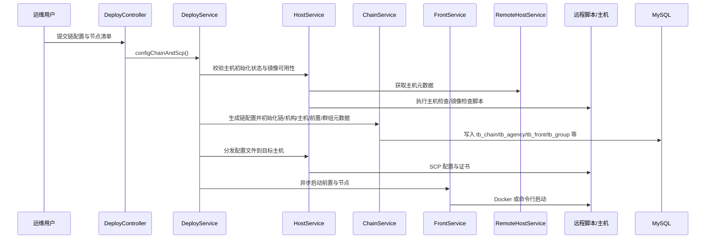
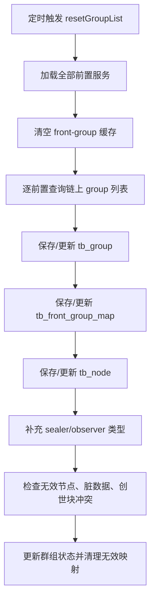
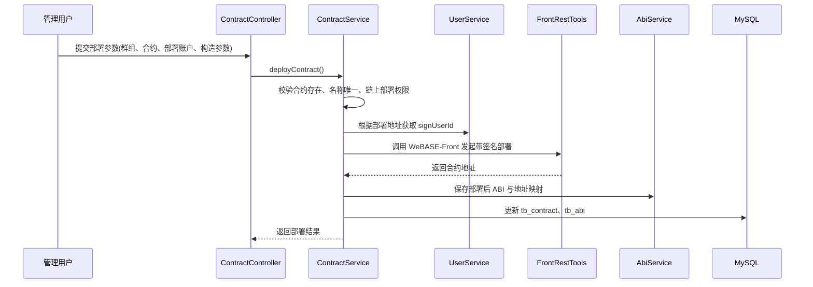
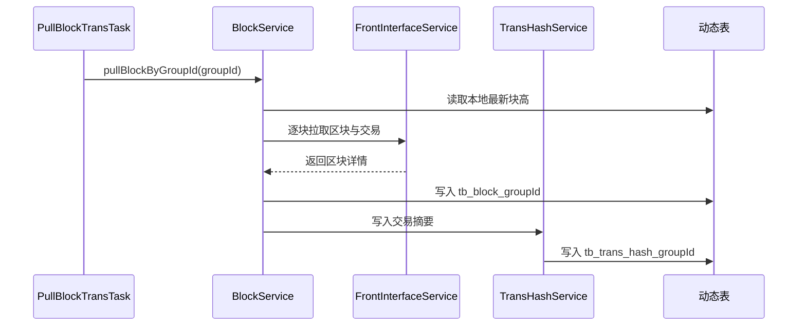
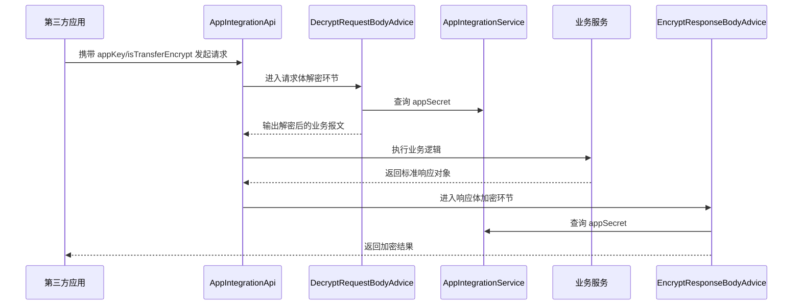
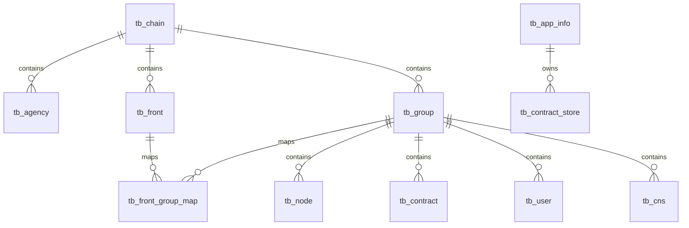

# WeBASE-Node-Manager 系统详细设计

## 1. 文档说明

### 1.1 文档目的

本文档用于在系统概要设计和系统架构设计的基础上，进一步细化 `WeBASE-Node-Manager` 的功能设计、业务流程、数据组织、配置策略与实施约束，为后续开发、联调、测试、部署和运维提供直接依据。

### 1.2 适用范围

本文档覆盖以下设计范围：

- FISCO BCOS 链、机构、主机、前置服务、群组、节点的部署与管理
- 合约、ABI、方法、仓库、脚手架、CNS 与链上调用管理
- 用户、私钥、证书、外部账户、外部合约识别与治理
- 区块、交易、事件、性能、统计、审计监控与告警通知
- 第三方应用接入与应用级加解密通信

### 1.3 设计依据

- 项目实现目录：`src/main/java/com/webank/webase/node/mgr`
- 应用配置：`src/main/resources/application.yml`
- 数据库脚本：`script/webase-ddl.sql`
- 详细设计编写模板：`src/main/resources/系统详细设计-prompt.md`
- 已有设计文档：`docs/系统概要设计.md`、`docs/系统架构设计.md`
- 部署脚本与模板：`script/deploy/*`、`src/main/resources/templates/*`

## 2. 基础功能设计

### 2.1 系统定位与管理主体

`WeBASE-Node-Manager` 设计为 WeBASE 体系中的节点管理与链运维后端中台，统一承接管理端与第三方应用的管理类请求，并向下协同 WeBASE-Front、WeBASE-Sign、远程主机服务和区块链网络。

| 管理主体 | 核心职责 | 典型关注点 | 设计约束 |
| --- | --- | --- | --- |
| 平台管理员 | 链部署、节点启停、资源配置、权限治理、告警维护 | 全量资源可见、全局配置可维护 | 允许跨账户、跨群组执行平台级管理操作 |
| 开发者/运维人员 | 合约开发、合约部署、用户维护、群组查看、节点观测 | 自身负责群组、合约目录、私钥归属 | 数据权限按登录账户收敛，禁止越权修改他人私钥 |
| 第三方业务应用 | 应用注册、链资源查询、用户导入、合约导入、SDK 下载 | 接入稳定性、接口安全、最小暴露 | 通过 `appKey/appSecret` 认证，可开启报文加密 |
| 监控/审计人员 | 异常交易分析、告警规则维护、邮件处理 | 异常发现、可追溯性、告警送达 | 读取本地链镜像与监控结果，不直接干预链执行 |

### 2.2 逻辑分层设计

系统采用“单体服务 + 模块化分层 + 外部集成协同”的实现方式，逻辑分层如下：

| 层次 | 设计职责 | 主要落地包 |
| --- | --- | --- |
| 接入层 | 提供 REST API、参数校验、统一响应、权限校验 | `block`、`group`、`deploy.controller`、`contract`、`user`、`appintegration.api` 等 Controller |
| 业务层 | 编排链部署、群组治理、合约管理、监控审计等核心流程 | 各领域 `Service` |
| 集成层 | 访问 WeBASE-Front、WeBASE-Sign、Dubbo 主机/用户服务、SMTP、Docker、Ansible、SSH | `front.frontinterface`、`deploy.service`、`alert.mail`、`tools` |
| 数据层 | 管理元数据、动态表、统计与告警数据持久化 | `Mapper`、Mapper XML、SQL Provider |
| 调度层 | 执行后台同步、统计、监控、告警、状态检查任务 | `scheduler`、`alert.task` |

### 2.3 统一接口与界面交互设计

#### 2.3.1 接口组织规则

- 管理端接口按业务域拆分，例如 `/deploy/**`、`/group/**`、`/contract/**`、`/monitor/**`
- 第三方接入接口统一放在 `/api/**`
- 所有接口统一采用 JSON 交互；文件下载场景返回二进制流，如 SDK 证书包、PEM、P12
- 统一返回结构采用 `BaseResponse` 和 `BasePageResponse`

#### 2.3.2 页面交互要素约束

虽然本系统为后端服务，但详细设计需要明确前端交互契约：

- 列表页统一支持 `pageNumber`、`pageSize`、关键字/状态筛选
- 详情页统一返回“基础信息 + 运行状态 + 关联资源”
- 高风险操作如删除群组、删除节点、删除合约、吊销权限，应在前端执行二次确认
- 启停、部署、扩容、导入、绑定私钥等长耗时操作，应提供进度查询或状态轮询入口
- 监控与统计页面以趋势图、排行表、异常清单三类视图为主，后端需提供聚合查询能力

#### 2.3.3 统一异常与返回码

- 业务异常统一抛出 `NodeMgrException`
- 参数异常统一通过 `BindingResult` 与 `ParamException` 处理
- 全局异常由 `ExceptionsHandler` 统一转换为标准返回码和返回信息
- 平台返回码定义集中在 `ConstantCode`、`RetCode`

### 2.4 认证、授权与数据权限设计

#### 2.4.1 管理端鉴权

- 管理端接口统一采用 Sa-Token 权限注解控制，如 `@SaCheckPermission`
- 登录态与用户上下文通过 `LoginHelper` 获取
- 调用 WeBASE-Front 转发到 WeBASE-Sign 时，系统会透传当前 token 信息，确保链上签名相关接口具备上下文

#### 2.4.2 角色与数据范围

- 平台管理员拥有全局管理能力
- 开发者角色默认按登录账户限定合约目录、私钥归属和外部对象可见范围
- 部分后台任务和统计任务在系统级运行时，通过 `DataPermissionHelper.ignore` 忽略数据隔离，以保证平台数据同步完整性

#### 2.4.3 第三方应用鉴权与报文保护

- 第三方应用通过 `appKey` 标识接入方
- 应用资料在 `tb_app_info` 中保存 `appSecret`
- 当请求头 `isTransferEncrypt=true` 时：
  - 请求体由 `DecryptRequestBodyAdvice` 使用 `appSecret` 前 16 位执行 AES 解密
  - 响应体由 `EncryptResponseBodyAdvice` 对返回 JSON 执行 AES 加密
- 若请求头加密开关与平台配置不一致，则直接拒绝请求

### 2.5 配置与外部依赖设计

#### 2.5.1 配置中心设计

系统采用“本地基础配置 + Nacos 远程配置”的组合方式：

| 配置来源 | 主要内容 | 设计要求 |
| --- | --- | --- |
| `application.yml` | 服务端口、应用名、Profile、Nacos 地址 | 仅保留启动必需配置 |
| Nacos `application-common.yml` | 公共常量、线程池、调用超时、任务周期 | 多环境统一外置 |
| Nacos `datasource.yml` | 数据源连接 | 不允许写死在代码中 |
| Nacos `bcos-node-mgr.yml` | 服务自身运行参数 | 按环境命名空间隔离 |

#### 2.5.2 关键运行参数

`ConstantProperties` 约束了以下关键能力：

- 链数据保留数量：`blockRetainMax`、`transRetainMax`、`monitorInfoRetainMax`
- 后台任务周期：拉块、群组刷新、审计监控、证书告警、节点告警、应用状态检查
- 部署超时与脚本路径：主机检查、端口检查、链配置生成、SCP、扩容并发超时
- 部署运行模式：`deployType`、`webaseSignAddress`、`nodesRootDir`
- 应用接入开关：`isTransferEncrypt`

#### 2.5.3 外部依赖

| 外部系统 | 作用 | 交互方式 |
| --- | --- | --- |
| Nacos | 配置中心、服务发现 | Spring Cloud Alibaba |
| MySQL | 平台元数据与链镜像数据存储 | JDBC + MyBatis |
| WeBASE-Front | 区块链访问统一入口 | HTTP REST |
| WeBASE-Sign | 私钥与签名服务 | 通过 WeBASE-Front 间接访问 |
| RemoteHostService | 远程主机元数据获取与状态更新 | Dubbo |
| 系统用户服务 | 登录用户资料、角色权限 | Dubbo/公共登录组件 |
| Docker/Ansible/SSH | 节点部署、镜像检查、远程启停 | Shell + 远程执行 |
| SMTP | 告警邮件发送 | JavaMail |

### 2.6 异步、调度与一致性设计

#### 2.6.1 线程模型

- 应用启动后开启异步执行能力和定时调度能力
- 链部署、节点扩容、节点重启、应用状态检查、群组刷新等场景采用异步线程池处理
- 多群组拉块、统计和监控采用 `CountDownLatch` 做批次收敛

#### 2.6.2 定时任务设计

| 任务 | 触发方式 | 主要职责 |
| --- | --- | --- |
| `PullBlockTransTask` | 固定延迟 | 按群组持续拉取区块与交易镜像 |
| `ResetGroupListTask` | 固定延迟 | 刷新群组、节点、映射与状态信息 |
| `StatisticsTransdailyTask` | Cron | 按日汇总交易数据 |
| `TransMonitorTask` | 固定周期 | 识别异常用户、异常合约、接口热点 |
| `DeleteInfoTask` | Cron | 清理过量区块、交易、审计与统计数据 |
| `AppStatusCheckTask` | 固定延迟 | 检查第三方应用在线状态 |
| `NodeStatusMonitorTask` | 固定延迟 | 检查节点异常并触发告警 |
| `ResourceMonitorTask` | 固定延迟 | 检查 Docker CPU/内存使用率并告警 |
| `CertMonitorTask` | 固定延迟 | 检查证书到期时间并告警 |
| `AuditMonitorTask` | 固定延迟 | 根据审计结果触发异常告警 |

#### 2.6.3 一致性策略

- 管理元数据变更尽量在单事务内完成，如链配置初始化、节点删除、群组删除
- 链镜像数据与监控结果采用最终一致性，通过后台任务持续校正
- 群组刷新前先清空映射缓存，再全量重建 `front-group` 映射，避免脏数据叠加
- 节点扩容采用“并发生成 + 收敛更新 + 异步启动”三阶段机制，降低多主机竞争

### 2.7 数据中心与动态表设计

#### 2.7.1 数据域划分

| 数据域 | 核心表 | 设计说明 |
| --- | --- | --- |
| 链与部署域 | `tb_chain`、`tb_agency`、`tb_host`、`tb_front`、`tb_node`、`tb_group`、`tb_front_group_map`、`tb_config` | 描述链部署拓扑与运行配置 |
| 合约资源域 | `tb_contract`、`tb_abi`、`tb_method`、`tb_contract_path`、`tb_cns`、`tb_contract_store` | 管理合约源码、ABI、方法、路径与应用导入资料 |
| 用户证书域 | `tb_user`、`tb_cert`、`tb_external_account`、`tb_external_contract` | 管理链上账户、证书和外部主体识别 |
| 监控统计域 | `tb_trans_daily`、`tb_stat`、`tb_govern_vote` | 管理统计结果与治理记录 |
| 告警域 | `tb_alert_rule`、`tb_mail_server_config`、`tb_alert_log` | 管理规则、邮件配置与告警记录 |
| 应用接入域 | `tb_app_info` | 管理第三方应用注册、状态与密钥 |
| 仓库域 | `tb_warehouse`、`tb_contract_folder`、`tb_contract_item` | 管理预置仓库与示例合约 |

#### 2.7.2 动态表设计

系统按群组创建高增长业务表：

- `tb_block_<groupId>`：区块镜像表
- `tb_trans_hash_<groupId>`：交易摘要表
- `tb_user_transaction_monitor_<groupId>`：审计监控表

`TableService` 在群组建立时自动创建表，在群组删除时自动回收表，以实现数据按群组隔离、按群组清理。

#### 2.7.3 数据生命周期

- 链、群组、节点、前置服务等元数据长期保存
- 区块、交易、监控、统计数据按保留上限滚动清理
- 仓库预置数据在应用启动时初始化加载
- 证书可重复拉取并按指纹去重
- 告警日志可修改处理状态，用于运维闭环跟踪

### 2.8 日志、审计与可观测性设计

- 应用日志采用 Log4j2
- 关键业务链路统一记录开始时间、结束时间、关键入参与处理结果
- 审计类数据除日志外需落表保存，支撑异常用户、异常合约、异常接口的长期查询
- 告警发送结果需落 `tb_alert_log`，支持确认、处理与复盘

## 3. 业务功能模块详细设计

### 3.1 链部署与主机运维模块

#### 3.1.1 模块定位

该模块负责链部署前的主机检查、链配置生成、文件分发、节点启动、节点扩容、链升级和链删除，是整个平台自动化运维的基础。

#### 3.1.2 功能设计

| 功能 | 说明 | 主要接口 |
| --- | --- | --- |
| 主机初始化 | 检查网络、Docker、依赖与端口可用性 | `/host/ping`、`/host/check`、`/deploy/init`、`/deploy/initCheck` |
| 链配置生成 | 生成链配置、机构证书、节点证书、前置配置并初始化数据库 | `/deploy/config` |
| 节点运维 | 节点启动、停止、强停、重启、删除 | `/deploy/node/start`、`/stop`、`/stopForce`、`/restart`、`/delete` |
| 链运维 | 全链启动、停止、重启、删除、升级、进度查询 | `/deploy/chain/start`、`/stop`、`/restart`、`/delete`、`/upgrade`、`/progress` |
| 节点扩容 | 多主机并发生成新节点并收敛启动 | `/deploy/node/add` |

#### 3.1.3 处理流程

#### 3.1.4 数据设计

| 数据对象 | 用途 |
| --- | --- |
| `tb_chain` | 链名称、版本、加密类型、部署状态、签名服务地址 |
| `tb_agency` | 机构与链关系 |
| `tb_host` | 主机基础信息与状态 |
| `tb_front` | 前置服务与节点部署信息 |
| `tb_config` | 镜像标签等配置项 |

#### 3.1.5 配置与实施约束

- 部署目录统一由 `nodesRootDir` 和 `nodesRootTmpDir` 管理
- 部署模式由 `deployType` 决定，需同时兼容命令行和 Docker
- `webaseSignAddress` 不允许配置为本地回环地址
- 扩容时先并发生成新节点，再统一更新已有节点配置，避免节点列表不一致

### 3.2 前置服务、群组与节点管理模块

#### 3.2.1 模块定位

该模块负责同步链上真实群组与节点拓扑，并维持前置服务、群组和节点之间的本地镜像关系。

#### 3.2.2 功能设计

| 功能 | 说明 | 主要接口 |
| --- | --- | --- |
| 前置发现与刷新 | 刷新前置状态、登记前置、设置资源配额 | `/front/refresh`、`/front/new`、`/front/setResource` |
| 群组查询 | 查询群组总览、详情、交易趋势、状态列表 | `/group/general/{groupId}`、`/group/all`、`/group/detail/{groupId}` |
| 群组操作 | 创建群组、启动/停止群组、批量启动、删除群组 | `/group/generate`、`/group/operate/{nodeId}`、`/group/batchStart`、`/group/{groupId}` |
| 节点查询与维护 | 节点列表、节点详情、城市信息、节点描述更新 | `/node/nodeList/**`、`/node/nodeInfo/**`、`/node/description` |

#### 3.2.3 群组同步流程

#### 3.2.4 数据设计

| 数据对象 | 用途 |
| --- | --- |
| `tb_front` | 记录前置 IP、端口、运行状态、容器信息、资源配置 |
| `tb_group` | 记录群组状态、节点数量、创世块时间、节点清单 |
| `tb_front_group_map` | 记录前置与群组关系，以及共识/观察节点类型 |
| `tb_node` | 记录节点块高、活跃状态、归属机构、描述信息 |

#### 3.2.5 关键设计约束

- 群组状态需支持正常、异常、脏数据冲突、创世块冲突等状态
- 节点删除前必须先停机，再更新相关 `config.ini` 和群组配置
- 群组删除时必须同步删除动态表与关联业务数据

### 3.3 合约、ABI、方法与仓库模块

#### 3.3.1 模块定位

该模块为链上智能合约提供从源码管理、ABI 管理、方法解析、部署调用，到 CNS、仓库复用、脚手架导出的完整闭环。

#### 3.3.2 功能设计

| 功能 | 说明 | 主要接口 |
| --- | --- | --- |
| 合约源码管理 | 合约新增、修改、删除、分页查询、按路径查询 | `/contract/save`、`/contract/contractList`、`/contract/{contractId}` |
| ABI 管理 | ABI 导入、更新、删除、全量查询 | `/abi/**` |
| 合约部署与调用 | 部署合约、发送链上交易、按字节码匹配合约 | `/contract/deploy`、`/contract/transaction`、`/contract/findByPartOfBytecodeBin` |
| 方法解析 | 从 ABI 抽取方法定义并缓存 | `/method/add`、`/method/findById/**` |
| CNS 管理 | 注册 CNS、查询 CNS、查询链上 CNS 列表 | `/contract/registerCns`、`/findCns`、`/findCnsList`、`/precompiled/cns/list` |
| 仓库与脚手架 | 查询预置仓库、复制示例合约、导出工程脚手架 | `/warehouse/**`、`/contract/copy`、`/scaffold/export` |

#### 3.3.3 合约部署流程

#### 3.3.4 数据设计

| 数据对象 | 用途 |
| --- | --- |
| `tb_contract` | 保存源码、ABI、BIN、部署地址、部署状态、部署人 |
| `tb_abi` | 保存独立 ABI 资产，用于地址绑定和链上识别 |
| `tb_method` | 保存 ABI 解析后的方法签名 |
| `tb_contract_path` | 保存合约目录结构 |
| `tb_cns` | 保存 CNS 注册信息 |
| `tb_contract_store` | 保存第三方应用导入的合约源码与 ABI |
| `tb_warehouse`、`tb_contract_folder`、`tb_contract_item` | 保存预置仓库资源 |

#### 3.3.5 关键设计约束

- 合约目录与合约名在同一账户、同一群组内必须唯一
- 已部署合约是否允许修改由 `deployedModifyEnable` 控制
- 调用非只读方法时必须通过 `signUserId` 发起签名交易
- 发送交易前需按需向 WeBASE-Front 推送 ABI，确保事件与方法解码可用

### 3.4 用户、私钥与证书模块

#### 3.4.1 模块定位

该模块负责链上用户元数据维护、私钥导入导出、绑定公钥账户、证书拉取和 SDK 证书包下载。

#### 3.4.2 功能设计

| 功能 | 说明 | 主要接口 |
| --- | --- | --- |
| 创建用户 | 生成新链账户，或导入私钥后创建账户 | `/user/userInfo` |
| 绑定公钥用户 | 只登记公钥/地址，不保存私钥 | `/user/bind` |
| 私钥导入 | 支持原始私钥、PEM、P12 三种方式 | `/user/import`、`/importPem`、`/importP12` |
| 私钥绑定 | 为公钥用户补绑私钥 | `/user/bind/privateKey`、`/pem`、`/p12` |
| 私钥导出 | 支持原始私钥、PEM、P12 导出 | `/user/export/**`、`/exportPem`、`/exportP12` |
| 证书管理 | 证书入库、删除、查询、拉取前置 SDK 证书 | `/cert/**` |

#### 3.4.3 用户私钥管理流程

1. 系统先校验群组存在、账户存在、用户名唯一、地址唯一。
2. 若传入私钥，则通过 WeBASE-Front/WeBASE-Sign 执行密钥导入；若未传入，则远程生成新密钥对。
3. 系统取得 `publicKey`、`address`、`signUserId` 后写入 `tb_user`。
4. 若为绑定私钥场景，系统必须校验“私钥推导地址”和“已有用户地址”完全一致。
5. 开发者只能绑定或导出归属自身账户的私钥。

#### 3.4.4 证书设计

- 证书按指纹唯一保存至 `tb_cert`
- 支持从前置服务拉取 SDK 证书文件内容
- 支持将 SDK 证书包动态写入本地临时文件后压缩下载
- 证书链关系通过 `father` 字段维护父子证书关系

#### 3.4.5 数据设计

| 数据对象 | 用途 |
| --- | --- |
| `tb_user` | 记录用户名、地址、公钥、`signUserId`、是否持有私钥 |
| `tb_cert` | 记录证书内容、指纹、有效期、父证书关系 |

### 3.5 区块、交易、事件、性能与统计模块

#### 3.5.1 模块定位

该模块负责把链上实时数据同步为可检索、可统计、可监控的本地镜像，并为页面提供区块浏览、交易查询、事件分析、性能对比和整体统计能力。

#### 3.5.2 功能设计

| 功能 | 说明 | 主要接口 |
| --- | --- | --- |
| 区块浏览 | 区块列表、按块高/哈希查询、头信息查询、统一搜索 | `/block/**` |
| 交易浏览 | 交易列表、交易详情、回执查询、消息签名 | `/transaction/**` |
| 事件分析 | 新区块事件、合约事件、事件日志、合约地址查询 | `/event/**` |
| 性能观测 | 前置节点性能比率、配置与链监控指标 | `/performance/**`、`/chain/monitorInfo/{frontId}` |
| 链统计 | 总体统计、链级统计、趋势对比 | `/stat`、`/stat/chain` |

#### 3.5.3 数据同步流程

#### 3.5.4 统计设计

- `StatisticsTransdailyTask` 按区块时间归并生成 `tb_trans_daily`
- `StatService` 按区块维度计算 TPS、块大小、块间隔等性能指标，落 `tb_stat`
- 页面展示的近七日交易趋势、链总览、性能对比均优先读取本地镜像而非直接访问链

#### 3.5.5 关键设计约束

- 拉块既支持从最新已存块高继续增量同步，也支持按配置从零开始
- 区块与交易查询需兼容本地镜像缺失时回源 WeBASE-Front
- 统计与性能计算不得阻塞管理端主接口

### 3.6 审计监控与外部主体识别模块

#### 3.6.1 模块定位

该模块对链上交易做增量审计，识别异常用户、异常合约和热点接口，并补充链外未知账户、未知合约的识别信息。

#### 3.6.2 功能设计

| 功能 | 说明 | 主要接口 |
| --- | --- | --- |
| 审计用户排行 | 统计用户交易活跃度 | `/monitor/userList/{groupId}` |
| 审计接口排行 | 统计接口调用频次 | `/monitor/interfaceList/{groupId}` |
| 审计明细 | 查询时间区间内用户/接口交易明细 | `/monitor/transList/{groupId}` |
| 异常用户 | 查询未知用户、异常来源地址 | `/monitor/unusualUserList/**` |
| 异常合约 | 查询未知合约、异常合约调用 | `/monitor/unusualContractList/**` |
| 外部账户/合约识别 | 将链上未知对象补录为外部主体 | `/external/**` |

#### 3.6.3 审计处理流程

1. `TransMonitorTask` 定时获取未统计交易。
2. `MonitorService` 拉取交易详情，识别交易发送方与调用目标。
3. 用户侧：
   - 若地址已存在于 `tb_user`，归类为已识别用户。
   - 否则记为异常用户，并可后续绑定或补录。
4. 合约侧：
   - 若合约地址或字节码可匹配 `tb_contract/tb_abi`，归类为已识别合约。
   - 否则记为异常合约，并保存接口名、异常类型。
5. 审计结果写入 `tb_user_transaction_monitor_<groupId>` 并聚合更新。

#### 3.6.4 数据设计

| 数据对象 | 用途 |
| --- | --- |
| `tb_user_transaction_monitor_<groupId>` | 保存审计聚合结果与异常信息 |
| `tb_external_account` | 保存外部账户识别信息 |
| `tb_external_contract` | 保存外部合约识别与部署来源 |

#### 3.6.5 关键设计约束

- 异常对象数量达到阈值后，系统应暂停继续放大异常数据，避免监控表无限增长
- 合约识别优先使用已知地址，再回退到运行时字节码匹配
- 外部主体识别应与本地合约、用户信息建立松耦合映射，而不是直接篡改核心主数据

### 3.7 预编译治理与系统配置模块

#### 3.7.1 模块定位

该模块封装 FISCO BCOS 预编译能力，为管理端提供共识节点治理、CRUD、合约状态、权限授予、委员会治理和系统参数调整能力。

#### 3.7.2 功能设计

| 功能域 | 主要接口 | 设计说明 |
| --- | --- | --- |
| CNS 查询 | `/precompiled/cns/list` | 读取链上 CNS 数据 |
| 共识节点治理 | `/precompiled/consensus/list`、`/precompiled/consensus` | 查询/新增/删除 sealer、observer 等 |
| CRUD | `/precompiled/crud` | 统一执行链上表 CRUD |
| 合约状态 | `/precompiled/contract/status`、`/list` | 冻结/解冻合约及历史查询 |
| 权限管理 | `/permission/**` | 权限列表、授权、回收、排序 |
| 链治理 | `/governance/**` | 委员会、权重、阈值、操作员、账户冻结 |
| 系统配置 | `/sys/config/**` | 读取和修改系统配置项 |
| 治理记录 | `/vote/record/**` | 查看和删除治理投票记录 |

#### 3.7.3 数据设计

| 数据对象 | 用途 |
| --- | --- |
| `tb_govern_vote` | 保存治理与投票记录 |

#### 3.7.4 关键设计约束

- 预编译调用统一通过 WeBASE-Front 间接访问链，不直接在业务模块中拼装底层 SDK 调用
- 影响链治理状态的操作必须绑定权限校验
- 对冻结/解冻、委员会调整、阈值更新等操作需保留可追溯记录

### 3.8 告警与通知模块

#### 3.8.1 模块定位

该模块负责规则维护、SMTP 配置、告警发送和告警日志闭环，是平台运维可观测性的外层保障。

#### 3.8.2 功能设计

| 功能 | 说明 | 主要接口 |
| --- | --- | --- |
| 规则管理 | 查询、更新、启停告警规则 | `/alert/**` |
| 邮件配置 | 查询和更新 SMTP 配置 | `/mailServer/**` |
| 邮件测试 | 发送测试邮件 | `/alert/mail/test/{toMailAddress}` |
| 日志管理 | 告警日志查询、详情、状态修改 | `/log/**` |

#### 3.8.3 告警任务设计

| 告警类型 | 判断逻辑 | 发送策略 |
| --- | --- | --- |
| 节点状态告警 | 节点失活且仍为有效共识/观察节点 | 按规则时间间隔发送 |
| 资源告警 | Docker CPU/内存连续多次命中阈值 | 本地累计命中 5 次后发送 |
| 证书告警 | 证书有效期进入 7 天内 | 按规则时间间隔发送 |
| 审计告警 | 异常用户/异常合约命中规则 | 依规则匹配发送 |

#### 3.8.4 数据设计

| 数据对象 | 用途 |
| --- | --- |
| `tb_alert_rule` | 告警阈值、通知对象、发送间隔、启用状态 |
| `tb_mail_server_config` | SMTP 主机、端口、账号、密码、SSL 配置 |
| `tb_alert_log` | 告警内容、级别、类型、处理状态、发送结果 |

### 3.9 第三方应用接入模块

#### 3.9.1 模块定位

该模块面向外部业务系统提供“应用注册 + 安全通信 + 节点与用户能力开放 + 合约导入”的集成通道。

#### 3.9.2 功能设计

| 功能 | 说明 | 主要接口 |
| --- | --- | --- |
| 应用管理 | 新增、修改、删除、分页查询应用 | `/app/save`、`/app/list`、`/app/{id}` |
| 应用注册 | 应用填写回调地址并激活状态 | `/api/appRegister` |
| 基础查询 | 获取加密类型、版本、群组、节点、前置、数据库信息 | `/api/basicInfo`、`/groupList`、`/nodeList`、`/frontList`、`/dbInfo` |
| 用户接入 | 新建用户、导入公钥、导入私钥/PEM/P12、用户列表与详情 | `/api/newUser`、`/importPublicKey`、`/userList`、`/userInfo` |
| 合约接入 | 保存合约源码、登记合约地址 | `/api/contractSourceSave`、`/contractAddressSave` |
| 证书下载 | 下载 SDK 证书内容 | `/api/sdkCert` |

#### 3.9.3 接入流程

#### 3.9.4 数据设计

| 数据对象 | 用途 |
| --- | --- |
| `tb_app_info` | 保存应用名称、`appKey`、`appSecret`、接入地址、状态 |
| `tb_contract_store` | 保存应用上传的合约源码、ABI、版本信息 |

#### 3.9.5 关键设计约束

- 应用名全局唯一
- `appKey` 为短标识，`appSecret` 为高强度随机串
- 应用注册后仍需通过在线状态检查任务定期校验可达性
- 第三方接口仅开放必要能力，不开放平台级运维操作

## 4. 关键数据对象设计

### 4.1 核心实体关系

### 4.2 数据落库原则

- 平台主数据以链、群组、节点、用户、合约为核心，采用固定表管理
- 高并发、高增长链数据采用群组动态表
- 统计、告警、治理记录采用附属域表存储
- 外部主体识别与应用导入数据独立建模，避免污染核心主数据

## 5. 非功能设计

### 5.1 安全性

- 管理端采用权限注解与登录上下文双重保护
- 第三方接口支持报文级加密
- 私钥不作为普通业务字段直接明文展示，导出时按需生成 PEM/P12 临时文件
- 高风险治理操作与告警配置修改必须具备明确权限

### 5.2 性能

- 链上高频查询优先读取本地镜像
- 拉块、审计、统计、扩容和应用状态检查采用异步和批处理
- 多群组并发执行时使用批次收敛，避免线程泄漏

### 5.3 可靠性

- 后台任务均需支持失败重试或下一周期补偿
- 节点与群组状态通过周期性刷新自我修正
- 删除和扩容操作在关键步骤失败时应保留日志并允许人工补救

### 5.4 可维护性

- 业务按领域分包，便于按模块演进
- 表结构、接口路径、脚本路径、配置项均保持显式命名
- 预置仓库、模板、脚本与核心业务代码解耦，便于替换升级

## 6. 实施约束与交付边界

- 本系统应作为 WeBASE 管理端后端服务独立部署，默认端口为 `5001`
- 系统启动必须能访问 Nacos 与 MySQL，链侧能力依赖 WeBASE-Front 可达
- 自动化部署能力依赖远程主机服务、Shell、SCP、Docker 或命令行运行环境
- 历史账号/角色/token 兼容结构可继续保留，但新建设计以 Sa-Token 与统一登录上下文为主
- 详细设计交付范围为后端服务，不包含前端视觉稿，但接口字段、分页规范、长耗时操作反馈方式已在本文中定义
